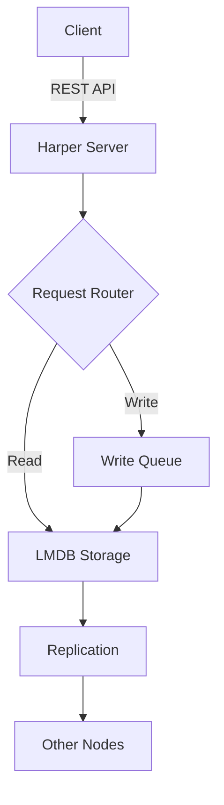
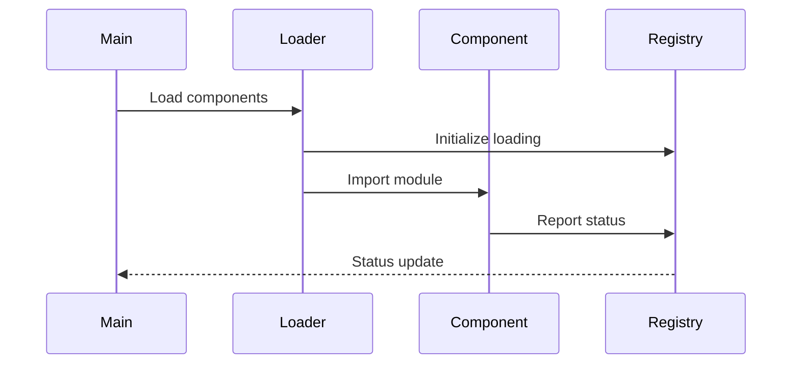

# Harper Documentation Requirements & Options

## Current State
- Documentation currently lives in a separate repository (`https://github.com/HarperDB/documentation`)
- Using GitBook service with significant limitations:
  - Cannot build/preview locally
  - Severely limits styling customization
  - Imposes constraints on directory structures
  - Mermaid chart integration not intuitive
  - Creates confusion about source of truth (GitBook UI vs Git repo)
  - Limited GitBook expertise on team
  - Documentation is versioned and released separately from the source code
  - Releases and updates are disconnected from code releases

## Key Design Decisions

### 1. Split Repository Architecture
- **Harper Repository** (`harperdb`): Contains documentation files in `/docs/`
- **Documentation Site Repository** (`harper-docs`): Contains Docusaurus configuration, build tools, and deployment
- **Benefits**: 
  - Clean separation of concerns
  - Documentation changes can be reviewed with code changes
  - Build tools don't clutter main repository
  - Easier to switch documentation platforms in future

### 2. No Repository Bloat
- **Problem**: Versioned docs would duplicate content and bloat the repository
- **Solution**: Use git tags/branches for versions, fetch at build time
- **Benefit**: Main branch stays clean, no duplicate content

### 3. Version Strategy Aligned with Harper Branching
- **Pattern**: Documentation follows Harper's branch strategy
- **Branch-based versioning**: Each branch can have its own documentation state
- **Release tags**: Tagged releases create immutable documentation snapshots
- **Result**: Documentation naturally versions with code changes

### 4. Local Development Experience
- **Write docs**: Edit markdown files in `harperdb/docs/`
- **Preview locally**: Run docs site that fetches from local Harper repo
- **See changes**: Refresh browser to see documentation updates
- **No complexity**: Simple environment variable switches between local and production modes

### 5. Addressing GitBook Pain Points
- **PR Integration**: ✅ Docs in Harper repo, reviewed with code changes
- **Styling**: ✅ Full control via React components and CSS
- **Directory Structure**: ✅ Organize however you want
- **Mermaid Support**: ✅ Native support, no failures
- **Source of Truth**: ✅ Git is the only source, no confusion
- **Expertise**: ✅ Uses React/Node.js, aligns with team skills

## Requirements

### Repository Structure
- [ ] Documentation should live in the main Harper repository (`harperdb/docs`)
- [ ] Support for versioning via tags and/or branches aligned with releases
- [ ] Easy to maintain alongside code changes

### Core Features
- [x] Local preview/build capability (**GitBook limitation solved**)
- [x] Version switching for different releases
- [x] Search functionality
- [x] Good navigation/sidebar structure
- [x] Code syntax highlighting
- [x] API documentation support
- [x] Mobile-responsive design
- [x] **Mermaid diagram support** (native in Docusaurus)
- [x] **Full styling customization** (React/CSS)
- [x] **Flexible directory structure** (configure as needed)

### Developer Experience
- [ ] Simple local development workflow
- [ ] Fast build times
- [ ] Hot reload during development
- [ ] Markdown-based content
- [ ] Easy to contribute (familiar tools)

### Deployment & Hosting
- [ ] CI/CD integration
- [ ] Automatic deployment on releases
- [ ] Custom domain support
- [ ] HTTPS/SSL
- [ ] Good performance/CDN

### Content Management
- [ ] Support for multiple documentation types:
  - [ ] Getting started guides
  - [ ] API reference
  - [ ] Tutorials
  - [ ] Architecture/concepts
  - [ ] Configuration reference
- [ ] Easy cross-referencing between pages
- [ ] Ability to embed diagrams/images
- [ ] Code examples with copy functionality

## Documentation Tool Options

### 🏆 1. Docusaurus (Recommended)
**Pros:**
- Built by Meta, widely adopted with excellent community
- **Perfect versioning support** - exactly what Harper needs
- React-based - aligns with team expertise
- MDX support allows React components in docs
- Built-in search (local or Algolia)
- Excellent plugin ecosystem
- First-class TypeScript support
- Great default themes with easy customization
- Optimized builds with code splitting

**Cons:**
- Slightly larger build size than pure SSGs
- More complex than simple Markdown renderers

**Example projects:** React, Jest, Redux, Babel, Prettier, Platformatic

**Why this fits Harper:**
- Team already knows React
- Mature versioning matches release workflow
- Can embed interactive API examples
- Active development and long-term stability

### 2. Nextra
**Pros:**
- Next.js based - familiar React patterns
- Excellent performance
- Beautiful default theme
- MDX support
- Simple configuration
- TypeScript support

**Cons:**
- **Versioning requires custom implementation**
- Smaller community than Docusaurus
- Less documentation-specific features

**Example projects:** SWR, Turborepo, Prisma

### 3. Astro + Starlight
**Pros:**
- Modern architecture with islands
- Starlight theme designed for docs
- Can use React components
- Excellent performance
- Growing ecosystem

**Cons:**
- **Newer - versioning still maturing**
- Less established patterns
- Smaller plugin ecosystem

**Example projects:** Astro docs, Starlight showcase

### 4. VitePress
**Pros:**
- **4x faster performance** than other JS-based generators
- Built on Vite - blazing fast dev experience
- Beautiful default theme designed for docs
- Built-in search and dark mode support
- Simple configuration approach
- Excellent for technical documentation
- Vue 3 powered but can write docs without Vue knowledge
- Full control via CSS variables and templates

**Cons:**
- **No built-in versioning support** (requires third-party plugin)
- Vue-based (though React team can still use effectively)
- Smaller ecosystem than Docusaurus
- Versioning plugin is community-maintained, not official

**Versioning Solution:** VitePress Versioning Plugin (community)
- Manages multiple versions with manual configuration
- Does NOT support automatic branch-based versioning
- Requires copying docs to version directories manually

**Example projects:** Vue.js docs, Vite docs, Vitest docs

### 5. MkDocs (Python-based - Not Recommended)
- Requires Python environment
- Not aligned with team's JavaScript focus

## Versioning Strategies (Avoiding Repository Bloat)

### Recommended: Branch-Based with Build-Time Assembly
**How it works:**
- Documentation lives in the same branches as code (e.g., `release_4.2` for 4.2.x releases)
- Patches update the existing minor version branch
- Main branch contains "next" documentation
- CI/CD assembles versions at build time, not stored in repo

**Benefits:**
- No duplicate content in main repository
- Clean git history
- Easy to backport documentation fixes
- Aligned with Harper's release strategy

**Implementation:**
```bash
# Harper's branch naming convention (same for code and docs)
release_4.2    # All 4.2.x documentation (4.2.0, 4.2.1, 4.2.2)
release_4.3    # All 4.3.x documentation
main           # Current version documentation
```

### Version Lifecycle
1. **Development**: All documentation changes happen in main branch
2. **Patch Releases** (e.g., 4.5.1, 4.5.2): Continue on main branch with patches
3. **New Minor/Major Version** (e.g., 4.6.0-alpha.1): 
   - Create `release_4.5` branch for previous version documentation
   - Main branch now tracks 4.6.x documentation
4. **Maintenance**: Any branch can receive documentation updates at any time
   - Push to `release_4.3` → rebuilds 4.3 docs
   - Push to `release_4.5` → rebuilds 4.5 docs
   - Push to `main` → rebuilds current docs

## Migration Considerations

1. **Content Migration**
   - Copy markdown files from documentation repository branches to harperdb/docs/
   - Map branches: documentation repo → harperdb repo (e.g., main → main, release_4.5 → release_4.5)
   - Adjust any GitBook-specific syntax if needed
   - Update internal links to match new structure

2. **URL Preservation**
   - Set up redirects from old URLs
   - Maintain SEO rankings

3. **CI/CD Setup**
   - GitHub Actions workflow for builds
   - Automatic deployment on merge/tag
   - Preview deployments for PRs

4. **Hosting Options**
   - GitHub Pages
   - Netlify
   - Vercel
   - Cloudflare Pages
   - Self-hosted

## Recommendation Criteria

When evaluating options, consider:

1. **Ease of adoption** - How quickly can the team start using it?
2. **Maintenance burden** - Long-term maintenance requirements
3. **Community support** - Active development and community
4. **Feature completeness** - Does it meet all requirements?
5. **Performance** - Build time and runtime performance
6. **Flexibility** - Ability to customize and extend

## Docusaurus Implementation Plan

### Quick Start POC
```bash
# In harperdb repository
npx create-docusaurus@latest docs classic --typescript
cd docs
npm start  # Local preview at http://localhost:3000
```

### Recommended Directory Structure

**Harper Repository (harperdb):**
```
harperdb/
├── docs/                    # Documentation content only
│   ├── README.md           # Docs overview & contribution guide
│   ├── intro.md
│   ├── getting-started/
│   │   ├── installation.md
│   │   ├── quick-start.md
│   │   └── docker.md
│   ├── api/
│   │   ├── rest-api.md
│   │   ├── operations-api.md
│   │   └── websocket-api.md
│   ├── configuration/
│   ├── tutorials/
│   └── architecture/
└── [rest of Harper codebase]
```

**Documentation Site Repository (harper-docs):**
```
harper-docs/
├── src/                    # React components & customizations
│   ├── components/
│   ├── css/
│   └── pages/
├── static/                 # Images, assets
├── scripts/
│   └── fetch-docs.js      # Script to fetch docs from harperdb
├── docusaurus.config.js
├── sidebars.js
├── package.json
└── .github/
    └── workflows/
        └── deploy.yml     # Auto-deploy on Harper releases
```

### Versioning Strategy with Split Repositories

**Smart Branch-Based Documentation Updates:**

The documentation site monitors Harper branches and only rebuilds what changes:

1. **Branch Change Detection**
   - GitHub Actions monitors `main` and `release_*` branches
   - Only triggers rebuild when docs/ directory changes
   - Each branch has its own build cache

2. **Selective Version Rebuilding**
   - When main branch updates: Only rebuild current version
   - When release_4.5 updates: Only rebuild 4.5 version
   - Other versions remain untouched in their cached state

3. **Efficient Resource Usage**
   - No unnecessary rebuilds of unchanged versions
   - Faster deployment times
   - Lower build costs
   - Documentation always matches its branch state

**Example Branch-Based Workflows:**
```yaml
# When docs change on main branch:
1. Push to main with docs/ changes
2. GitHub Action detects docs change
3. Docs site workflow:
   - Fetches only main branch docs
   - Rebuilds only current version
   - Updates production site

# When docs change on release_4.5:
1. Push to release_4.5 with docs/ changes
2. GitHub Action detects docs change
3. Docs site workflow:
   - Fetches only release_4.5 docs
   - Rebuilds only 4.5 version
   - Updates production site
```

**versions.json Structure:**
```json
{
  "current": {
    "version": "4.6",
    "branch": "main",
    "label": "4.6 (Current)"
  },
  "versions": {
    "4.5": {
      "branch": "release_4.5",
      "label": "4.5"
    },
    "4.4": {
      "branch": "release_4.4",
      "label": "4.4"
    },
    "4.3": {
      "branch": "release_4.3",
      "label": "4.3"
    },
    "4.2": {
      "branch": "release_4.2",
      "label": "4.2"
    }
  }
}
```

**Docusaurus Configuration for External Docs:**
```javascript
// harper-docs/docusaurus.config.js
module.exports = {
  presets: [
    [
      '@docusaurus/preset-classic',
      {
        docs: {
          id: 'current',
          path: './docs-current',
          routeBasePath: '/',
          versions: {
            current: {
              label: 'Next',
              path: '/',
            },
          },
        },
      },
    ],
  ],
  plugins: [
    [
      '@docusaurus/plugin-content-docs',
      {
        id: 'version-4.3',
        path: './docs-4.3',
        routeBasePath: 'v4.3',
        versions: {
          current: {
            label: '4.3.x',
            banner: 'none',
          },
        },
      },
    ],
    [
      '@docusaurus/plugin-content-docs',
      {
        id: 'version-4.2',
        path: './docs-4.2',
        routeBasePath: 'v4.2',
        versions: {
          current: {
            label: '4.2.x',
            banner: 'none',
          },
        },
      },
    ],
  ],
};
```

### Example docusaurus.config.js with Mermaid Support
```javascript
module.exports = {
  title: 'Harper Documentation',
  tagline: 'High-performance distributed database',
  url: 'https://docs.harperdb.io',
  baseUrl: '/',
  onBrokenLinks: 'throw',
  favicon: 'img/favicon.ico',
  organizationName: 'HarperDB',
  projectName: 'harperdb',

  presets: [
    [
      'classic',
      {
        docs: {
          sidebarPath: require.resolve('./sidebars.js'),
          editUrl: 'https://github.com/HarperDB/harperdb/tree/main/docs/',
          versions: {
            current: {
              label: 'Next',
              path: 'next',
            },
          },
        },
        theme: {
          customCss: require.resolve('./src/css/custom.css'),
        },
      },
    ],
  ],

  // Native Mermaid support
  themes: ['@docusaurus/theme-mermaid'],
  markdown: {
    mermaid: true,
  },

  themeConfig: {
    navbar: {
      title: 'Harper',
      logo: {
        alt: 'Harper Logo',
        src: 'img/logo.svg',
      },
      items: [
        {
          type: 'docsVersionDropdown',
          position: 'right',
        },
        {
          href: 'https://github.com/HarperDB/harperdb',
          label: 'GitHub',
          position: 'right',
        },
      ],
    },
    prism: {
      theme: lightCodeTheme,
      darkTheme: darkCodeTheme,
      additionalLanguages: ['bash', 'json', 'yaml'],
    },
    // Mermaid theme configuration
    mermaid: {
      theme: {light: 'neutral', dark: 'dark'},
    },
    algolia: {
      // Algolia search configuration
      appId: 'YOUR_APP_ID',
      apiKey: 'YOUR_API_KEY',
      indexName: 'harperdb',
    },
  },
};
```

### Example Mermaid Usage in Documentation
```markdown
# Harper Architecture

## Data Flow



## Component Lifecycle



### Incremental Build System

*Note: this is just an initial first pass idea from claude*

Instead of rebuilding all versions, use branch-specific workflows:

**Branch-specific build (harper-docs/scripts/build-branch.js):**
```javascript
const { execSync } = require('child_process');
const fs = require('fs-extra');
const versions = require('../versions.json');

// Get branch from environment or command line
const branch = process.env.BRANCH || process.argv[2];
if (!branch) {
  console.error('Usage: node build-branch.js <branch>');
  process.exit(1);
}

async function buildBranch() {
  console.log(`Building documentation for branch: ${branch}`);
  
  // Determine version from branch
  let version, versionPath;
  if (branch === 'main') {
    version = versions.current.version;
    versionPath = 'current';
  } else {
    const versionInfo = versions.versions.find(v => v.branch === branch);
    if (!versionInfo) {
      console.error(`No version configuration found for branch: ${branch}`);
      process.exit(1);
    }
    version = versionInfo.version;
    versionPath = `v${version}`;
  }
  
  // Fetch docs from specific branch
  const tempDir = `harper-${branch}`;
  execSync(`git clone --depth 1 --branch ${branch} --sparse https://github.com/HarperDB/harperdb.git ${tempDir}`);
  execSync(`cd ${tempDir} && git sparse-checkout set docs`);
  
  // Copy to version-specific directory
  await fs.copy(`${tempDir}/docs`, `./docs-${version}`);
  await fs.remove(tempDir);
  
  // Build only this version
  execSync(`npm run build:version -- ${version}`, { stdio: 'inherit' });
  
  // Deploy only this version's files
  console.log(`Deploying ${versionPath} to production...`);
  // Deployment logic here
}

buildBranch().catch(console.error);
```

### GitHub Actions Deployment

**In Harper Repository (harperdb):**
```yaml
# .github/workflows/notify-docs.yml
name: Notify Documentation Site

on:
  push:
    branches: 
      - main
      - 'release_*'
    paths:
      - 'docs/**'

jobs:
  notify:
    runs-on: ubuntu-latest
    steps:
      - name: Extract branch name
        run: echo "BRANCH=${GITHUB_REF#refs/heads/}" >> $GITHUB_ENV
      
      - name: Trigger docs rebuild for branch
        uses: peter-evans/repository-dispatch@v2
        with:
          token: ${{ secrets.DOCS_REPO_TOKEN }}
          repository: HarperDB/harper-docs
          event-type: docs-update
          client-payload: '{"branch": "${{ env.BRANCH }}", "sha": "${{ github.sha }}"}'
```

**In Documentation Repository (harper-docs):**
```yaml
# .github/workflows/deploy.yml
name: Build and Deploy Branch Docs

on:
  repository_dispatch:
    types: [docs-update]
  workflow_dispatch:
    inputs:
      branch:
        description: 'Branch to build docs from'
        required: true
        default: 'main'

jobs:
  build-deploy-branch:
    runs-on: ubuntu-latest
    steps:
      - name: Checkout docs site
        uses: actions/checkout@v3
      
      - name: Determine branch to build
        run: |
          if [ "${{ github.event_name }}" = "repository_dispatch" ]; then
            echo "BRANCH=${{ github.event.client_payload.branch }}" >> $GITHUB_ENV
          else
            echo "BRANCH=${{ github.event.inputs.branch }}" >> $GITHUB_ENV
          fi
      
      - name: Setup Node.js
        uses: actions/setup-node@v3
        with:
          node-version: 20
          cache: 'npm'
          
      - name: Install dependencies
        run: npm ci
      
      - name: Build specific branch documentation
        run: |
          echo "Building docs for branch: ${{ env.BRANCH }}"
          node scripts/build-branch.js ${{ env.BRANCH }}
      
      - name: Deploy to CDN
        run: |
          # Deploy only the changed version files
          # This could be S3, Cloudflare, etc.
          echo "Deploying updated version to CDN..."
          # aws s3 sync ./build/v$VERSION s3://docs-bucket/v$VERSION --delete
```

### Version Management Scripts

**Update versions on release (harper-docs/scripts/update-versions.js):**
```javascript
const fs = require('fs');
const semver = require('semver');

const newTag = process.argv[2];
if (!newTag) {
  console.error('Usage: node update-versions.js <tag>');
  process.exit(1);
}

// Read current versions
const versions = JSON.parse(fs.readFileSync('./versions.json', 'utf8'));

// Parse version from tag (e.g., v4.3.0 -> 4.3)
const version = semver.parse(newTag);
const minorVersion = `${version.major}.${version.minor}`;

// Update or add version entry
versions[minorVersion] = newTag;

// Keep only last 3-4 minor versions
const sortedVersions = Object.keys(versions)
  .sort((a, b) => semver.compare(b, a))
  .slice(0, 4);

const newVersions = {};
sortedVersions.forEach(v => {
  newVersions[v] = versions[v];
});

// Write updated versions
fs.writeFileSync('./versions.json', JSON.stringify(newVersions, null, 2));
console.log(`Updated versions.json with ${newTag}`);
```

**Cache-aware version check (harper-docs/scripts/check-versions.js):**
```javascript
const { execSync } = require('child_process');
const fs = require('fs-extra');
const crypto = require('crypto');
const versions = require('../versions.json');

// Check which versions need rebuilding
async function checkVersions() {
  const rebuilds = [];
  const cacheFile = '.version-cache.json';
  const cache = await fs.readJson(cacheFile).catch(() => ({}));
  
  // Check current version
  const currentHash = await getBranchHash(versions.current.branch);
  if (cache.current !== currentHash) {
    rebuilds.push({ ...versions.current, type: 'current' });
    cache.current = currentHash;
  }
  
  // Check each version
  for (const version of versions.versions) {
    const hash = await getBranchHash(version.branch);
    if (cache[version.version] !== hash) {
      rebuilds.push({ ...version, type: 'version' });
      cache[version.version] = hash;
    }
  }
  
  // Save updated cache
  await fs.writeJson(cacheFile, cache, { spaces: 2 });
  
  return rebuilds;
}

async function getBranchHash(branch) {
  try {
    const output = execSync(
      `git ls-remote https://github.com/HarperDB/harperdb.git ${branch}`,
      { encoding: 'utf8' }
    );
    const [hash] = output.trim().split('\t');
    return hash;
  } catch (error) {
    console.error(`Failed to get hash for branch ${branch}`);
    return null;
  }
}

// Only rebuild what changed
checkVersions().then(rebuilds => {
  if (rebuilds.length === 0) {
    console.log('All versions are up to date');
    return;
  }
  
  console.log(`Need to rebuild: ${rebuilds.map(r => r.version).join(', ')}`);
  // Trigger builds only for changed versions
  rebuilds.forEach(version => {
    execSync(`node scripts/build-branch.js ${version.branch}`, { stdio: 'inherit' });
  });
});
```

## Next Steps

1. [ ] Review and refine requirements
2. [ ] Create Docusaurus POC in harperdb/docs
3. [ ] Test versioning with a mock release
4. [ ] Set up custom React components for API docs
5. [ ] Configure GitHub Actions for deployment
6. [ ] Migrate sample content from GitBook
7. [ ] Set up redirects from old URLs
8. [ ] Configure custom domain

## Proof of Concept Instructions

### Step 1: Set Up Documentation in Harper Repository
```bash
cd /Users/nathan/src/harper/harperdb

# Create docs directory structure
mkdir -p docs/getting-started
mkdir -p docs/api-reference  
mkdir -p docs/configuration
mkdir -p docs/tutorials
mkdir -p docs/architecture

# Create initial documentation files
echo "# Harper Documentation" > docs/README.md
echo "# Getting Started" > docs/getting-started/installation.md
echo "# REST API Reference" > docs/api-reference/rest-api.md

# Commit documentation
git add docs/
git commit -m "Add initial documentation structure"
```

### Step 2: Create Documentation Site Repository
```bash
# In a separate location
cd /Users/nathan/src/harper
npx create-docusaurus@latest harper-docs classic --typescript
cd harper-docs

# Remove default docs (we'll fetch from harperdb)
rm -rf docs

# Create fetch script
mkdir scripts
cat > scripts/fetch-docs.js << 'EOF'
const { execSync } = require('child_process');
const fs = require('fs-extra');

async function fetchDocs() {
  // For local development, use local path
  const HARPER_PATH = '../harperdb';
  
  // Copy docs from local Harper repo
  await fs.copy(`${HARPER_PATH}/docs`, './docs-current');
  console.log('Documentation fetched successfully!');
}

fetchDocs().catch(console.error);
EOF
```

### Step 3: Configure Docusaurus for External Docs
```bash
# Update docusaurus.config.js to use fetched docs
# Update package.json to include fetch script:
npm pkg set scripts.fetch="node scripts/fetch-docs.js"
npm pkg set scripts.start="npm run fetch && docusaurus start"
npm pkg set scripts.build="npm run fetch && docusaurus build"
```

### Step 4: Test Local Development
```bash
# In harper-docs repository
npm run start
# Opens http://localhost:3000 with Harper documentation
```

### Step 5: Test Documentation Updates
```bash
# Make changes in harperdb/docs/
cd ../harperdb
echo "## New Section" >> docs/getting-started/installation.md

# See changes in documentation site
cd ../harper-docs
npm run start  # Will fetch latest docs and rebuild
```

## Local Development Workflow

### Quick Start (Simplest)
From the Harper repository, you can run documentation preview directly:
```bash
# From harperdb directory
npm run docs:dev  # Starts local documentation server
```

This requires one-time setup of the documentation site repository alongside Harper.

### Option 1: Direct Path Configuration
Update `harper-docs/scripts/fetch-docs.js` to use local paths:
```javascript
const fs = require('fs-extra');
const path = require('path');

async function fetchDocs() {
  const isLocal = process.env.LOCAL_DOCS === 'true';
  
  if (isLocal) {
    // Use local Harper repository
    const harperPath = process.env.HARPER_PATH || '../harperdb';
    console.log(`Using local docs from ${harperPath}`);
    await fs.copy(path.join(harperPath, 'docs'), './docs-current');
  } else {
    // Fetch from GitHub (production mode)
    // ... existing fetch logic ...
  }
}

fetchDocs().catch(console.error);
```

Then create a `.env.local` file in harper-docs:
```bash
LOCAL_DOCS=true
HARPER_PATH=../harperdb
```

### Option 2: Symlink Approach
Create a symlink for instant updates:
```bash
cd harper-docs
rm -rf docs-current
ln -s ../harperdb/docs docs-current
npm run docusaurus start -- --no-minify
```

### Option 3: Watch Mode Script
Create `harper-docs/scripts/watch-local.js`:
```javascript
const chokidar = require('chokidar');
const fs = require('fs-extra');
const path = require('path');

const HARPER_DOCS = '../harperdb/docs';
const LOCAL_DOCS = './docs-current';

// Initial copy
fs.copySync(HARPER_DOCS, LOCAL_DOCS);

// Watch for changes
chokidar.watch(HARPER_DOCS, {
  ignoreInitial: true,
  persistent: true
}).on('all', (event, filePath) => {
  const relativePath = path.relative(HARPER_DOCS, filePath);
  const destPath = path.join(LOCAL_DOCS, relativePath);
  
  if (event === 'unlink' || event === 'unlinkDir') {
    fs.removeSync(destPath);
  } else if (event === 'add' || event === 'change') {
    fs.copySync(filePath, destPath);
  }
  
  console.log(`${event}: ${relativePath}`);
});

console.log(`Watching ${HARPER_DOCS} for changes...`);
```

Add to package.json:
```json
{
  "scripts": {
    "dev": "node scripts/watch-local.js & docusaurus start",
    "dev:stop": "pkill -f watch-local.js"
  }
}
```

### Recommended Local Setup
```bash
# One-time setup
cd harper-docs
npm install
echo "LOCAL_DOCS=true" > .env.local
echo "HARPER_PATH=../harperdb" >> .env.local

# Daily workflow
npm run start  # Fetches from local harperdb and starts dev server

# Make changes in harperdb/docs/
# Refresh browser to see changes
```

### Option 4: Run from Harper Repository (Most Convenient)
Add to `harperdb/package.json`:
```json
{
  "scripts": {
    "docs:dev": "cd ../harper-docs && npm run start",
    "docs:build": "cd ../harper-docs && npm run build",
    "docs:setup": "cd .. && git clone https://github.com/HarperDB/harper-docs.git && cd harper-docs && npm install && echo 'LOCAL_DOCS=true\\nHARPER_PATH=../harperdb' > .env.local"
  }
}
```

Then from Harper repository:
```bash
# One-time setup (clones and configures docs site)
npm run docs:setup

# Daily workflow - run from harperdb directory!
npm run docs:dev

# Opens browser with local documentation preview
# Edit docs/ files and see changes immediately
```

### Alternative: Using npx for Zero Setup
Create `harperdb/scripts/preview-docs.js`:
```javascript
#!/usr/bin/env node
const { spawn } = require('child_process');
const fs = require('fs');
const path = require('path');

const docsPath = path.join(__dirname, '..', '..', 'harper-docs');

// Check if harper-docs exists
if (!fs.existsSync(docsPath)) {
  console.log('Documentation site not found. Run: npm run docs:setup');
  process.exit(1);
}

// Start the docs server
const docs = spawn('npm', ['run', 'start'], {
  cwd: docsPath,
  stdio: 'inherit',
  env: {
    ...process.env,
    LOCAL_DOCS: 'true',
    HARPER_PATH: path.join(__dirname, '..')
  }
});

docs.on('error', (err) => {
  console.error('Failed to start docs server:', err);
  process.exit(1);
});
```

Add to package.json:
```json
{
  "scripts": {
    "docs:dev": "node scripts/preview-docs.js"
  }
}
```

### Step 5: Custom React Component Example
Create `docs/src/components/ApiEndpoint.tsx`:
```tsx
import React from 'react';

interface ApiEndpointProps {
  method: 'GET' | 'POST' | 'PUT' | 'DELETE';
  path: string;
  description: string;
}

export default function ApiEndpoint({ method, path, description }: ApiEndpointProps) {
  const methodColors = {
    GET: '#61affe',
    POST: '#49cc90',
    PUT: '#fca130',
    DELETE: '#f93e3e',
  };

  return (
    <div style={{ marginBottom: '1rem', padding: '1rem', border: '1px solid #e0e0e0', borderRadius: '4px' }}>
      <div style={{ display: 'flex', alignItems: 'center', marginBottom: '0.5rem' }}>
        <span style={{
          backgroundColor: methodColors[method],
          color: 'white',
          padding: '0.25rem 0.5rem',
          borderRadius: '4px',
          fontWeight: 'bold',
          marginRight: '0.5rem'
        }}>
          {method}
        </span>
        <code>{path}</code>
      </div>
      <p>{description}</p>
    </div>
  );
}
```

Use in MDX:
```mdx
import ApiEndpoint from '@site/src/components/ApiEndpoint';

<ApiEndpoint 
  method="POST" 
  path="/api/v1/tables/:table/records" 
  description="Insert one or more records into a table"
/>
```

## Example Documentation Structure

```
docs/
├── docs/
│   ├── intro.md                    # Welcome page
│   ├── getting-started/
│   │   ├── _category_.json         # Category metadata
│   │   ├── installation.md
│   │   ├── quick-start.md
│   │   └── docker.md
│   ├── api-reference/
│   │   ├── _category_.json
│   │   ├── rest-api.md
│   │   ├── operations-api.md
│   │   └── websocket-api.md
│   ├── configuration/
│   │   ├── _category_.json
│   │   ├── config-file.md
│   │   ├── environment-vars.md
│   │   └── clustering.md
│   ├── tutorials/
│   │   ├── _category_.json
│   │   ├── build-rest-api.md
│   │   ├── real-time-app.md
│   │   └── data-modeling.md
│   └── architecture/
│       ├── _category_.json
│       ├── overview.md
│       ├── storage-engine.md
│       └── replication.md
├── src/
│   ├── components/          # React components
│   ├── css/                # Custom styles
│   └── pages/              # Custom pages (landing, etc.)
├── static/                  # Images, downloads
├── docusaurus.config.js
├── sidebars.js             # Sidebar configuration
└── package.json
```

### Example _category_.json
```json
{
  "label": "Getting Started",
  "position": 1,
  "link": {
    "type": "generated-index",
    "description": "Learn how to install and start using Harper."
  }
}
```

### Example sidebars.js
```javascript
module.exports = {
  docs: [
    'intro',
    {
      type: 'category',
      label: 'Getting Started',
      items: [
        'getting-started/installation',
        'getting-started/quick-start',
        'getting-started/docker',
      ],
    },
    {
      type: 'category',
      label: 'API Reference',
      items: [
        'api-reference/rest-api',
        'api-reference/operations-api',
        'api-reference/websocket-api',
      ],
    },
    // ... more categories
  ],
};
```

## Migration Strategy from Documentation Repository

1. **Direct Content Copy**
   - Copy markdown files from `HarperDB/documentation` branches to `HarperDB/harperdb/docs/`
   - Branch mapping:
     - `documentation:main` → `harperdb:main/docs/`
     - `documentation:release_4.5` → `harperdb:release_4.5/docs/`
   - Preserve directory structure where possible

2. **Content Adjustments**
   ```bash
   # Example migration script for each branch
   cd /path/to/documentation
   git checkout main
   cp -r docs/* /path/to/harperdb/docs/
   
   # Review and adjust:
   # - GitBook-specific syntax (if any)
   # - Internal links
   # - Image paths
   ```

3. **URL Redirect Configuration**
   ```javascript
   // docusaurus.config.js - maintain old URL patterns
   module.exports = {
     redirects: [
       {
         from: '/developers/applications',
         to: '/docs/developers/applications',
       },
       // Add more redirects as needed
     ],
   };
   ```

## Benefits of Split Repository Approach

### For Harper Development
1. **Documentation with code**: Documentation changes are reviewed in PRs alongside code changes
2. **Single source of truth**: Documentation lives with the code it describes
3. **No build tool clutter**: Main repository stays focused on Harper code
4. **Simpler CI/CD**: Harper CI doesn't need to know about documentation builds

### For Documentation Site
1. **Platform flexibility**: Easy to switch from Docusaurus to another tool
2. **Independent deployment**: Can update site features without touching Harper
3. **Version management**: Site controls how versions are fetched and displayed
4. **Custom tooling**: Can add search, analytics, etc. without affecting Harper repo

### For Contributors
1. **Familiar workflow**: Edit markdown files in the Harper repo
2. **Immediate preview**: Local Docusaurus site fetches from local Harper repo
3. **No duplicate work**: Write docs once, displayed everywhere

### Automation Benefits
1. **Zero-touch releases**: Documentation automatically updates with Harper releases
2. **Always in sync**: Impossible for docs to drift from released versions
3. **No manual version management**: versions.json updates automatically
4. **Instant updates**: New releases trigger immediate documentation deployment
5. **Rollback support**: Can redeploy any previous version by tag

## Migration Path

1. **Phase 1**: Set up split repository structure
   - Create harper-docs repository with Docusaurus
   - Configure versions.json for existing Harper versions
   - Test build and deployment pipeline

2. **Phase 2**: Content migration
   - Copy markdown files from documentation repo to harperdb/docs/
   - Start with main branch, then migrate release branches
   - Adjust any GitBook-specific formatting
   - Update image and link references

3. **Phase 3**: Production deployment
   - Deploy initial version to staging
   - Set up URL redirects from old GitBook site
   - Configure custom domain (docs.harperdb.io)
   - Switch DNS and monitor for issues

## Alternative: Staying with GitBook

### What Would Be Needed to Continue with GitBook

**Option 1: GitBook Cloud (Current Approach)**
- Continue using GitBook's hosted service
- Accept fundamental limitations that cannot be solved

**Critical Limitation: No Local Development**
- **GitBook CLI is officially deprecated** since 2020
- **No command-line tools available** - must work exclusively in GitBook.com UI
- **No local preview possible** - cannot test changes before publishing
- **Community forks exist** but have hundreds of vulnerabilities

**Required Compromises:**
1. **Accept no local development environment**
2. **Work exclusively in GitBook.com web interface**
3. **Manual version management** with no automation possible
4. **No integration with development workflows**
5. **Complete vendor lock-in** with no migration tools

**Major Limitations That Remain:**
1. **Version Management**: Completely disconnected from Harper's branch strategy
2. **Local Development**: Impossible - no CLI or local preview
3. **Automation**: Cannot automate any documentation workflows
4. **Customization**: Limited to GitBook's themes and features
5. **Team Productivity**: Severely impacted by lack of familiar tools
6. **Source of Truth**: Permanent confusion between Git and GitBook UI
7. **Migration Risk**: No exit strategy if GitBook changes pricing/features

**Cost-Benefit Analysis:**
- **Benefit**: No migration effort required
- **Cost**: No local development environment whatsoever
- **Cost**: Cannot integrate with CI/CD pipelines
- **Cost**: Documentation permanently disconnected from code
- **Cost**: Team forced to use unfamiliar web-based workflow
- **Cost**: No ability to automate or script documentation tasks

**Recommendation**: GitBook's deprecation of all CLI tools makes it fundamentally incompatible with modern documentation workflows. The inability to preview locally, automate builds, or integrate with development tools makes staying with GitBook a significant liability for technical documentation.

## Alternative: GitHub Pages with Jekyll

### Jekyll + GitHub Pages Approach
**Pros:**
- Zero hosting costs
- Native GitHub integration
- Simple markdown files
- Mermaid support via plugins
- Full control over styling

**Cons:**
- Less built-in documentation features
- Manual version switching implementation
- Limited to Ruby-based customization
- No built-in search (need Algolia or similar)

**Implementation:**
```yaml
# _config.yml
title: Harper Documentation
theme: just-the-docs  # Popular docs theme

plugins:
  - jekyll-mermaid
  - jekyll-sitemap
  - jekyll-seo-tag

collections:
  docs:
    output: true
    permalink: /:collection/:path/
```

### Why Docusaurus May Be Better for Harper
1. **React expertise**: Your team already knows React
2. **Better versioning**: Built-in version management
3. **Richer features**: Search, MDX, components
4. **Active ecosystem**: Constant improvements
5. **Migration path**: Easier to migrate from GitBook

## Questions to Answer

- ~~What specific GitBook limitations are most problematic?~~ ✅ Addressed
- ~~Are there any must-have features beyond those listed?~~ ✅ Mermaid support added
- What's the preferred hosting solution? (GitHub Pages works with Docusaurus too!)
- How many versions need to be maintained simultaneously?
- Are there any specific integrations needed (e.g., API docs generation from OpenAPI spec)?
- What's the timeline for migration?
- ~~Should we integrate with the Harper release process for automatic versioning?~~ ✅ Yes, automated