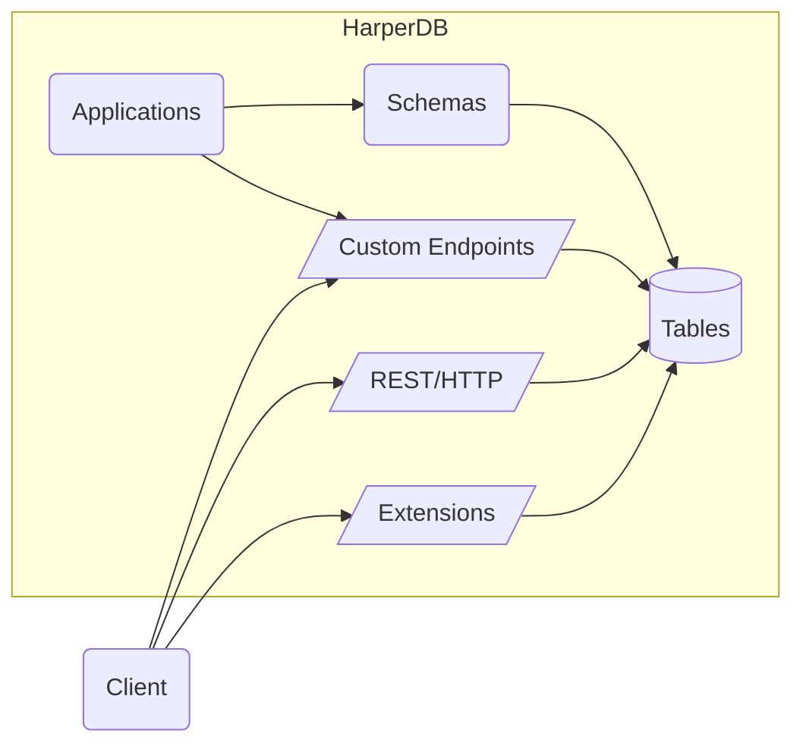

# Application Development Guide

HarperDB is more than just a database, developing database applications allows you package your schema, endpoints, and application logic together and deploy to an entire cluster of HarperDB instances, ready to scale to on-the-edge delivery of data through endpoints.

To create a HarperDB application, we recommend starting with the [application template](https://github.com/HarperDB/application-template) which you can download or clone. However you can also simply create a new empty project folder. (If you plan to use git, you can initialize you new project).

And we go into our new application folder and start HarperDB running our new application (you don't need anything in it to get started!):
```shell
harperdb run .
```

HarperDB can host multiple applications and extensions. Any package that is added to HarperDB is called a "component", and components are generally categorized as "applications", which deliver a set of endpoints for users, and "extensions", which are building blocks for features like authentication, additional protocols, and connectors that can be used by other components. Components can be added to the your hdb/components directory, and all such components will be loaded by HarperDB when it starts (using `harperdb run .` allows us to specifically load a certain application in addition to any that have been added to hdb/components).



## Create a Table
This is a database application, so naturally a first step is create a table. The easiest way to do that is through a GraphQL Schema (GraphQL Schemas are the quickest way to define tables in HarperDB, but does not mean you are required to, or even necessarily should, use GraphQL to query). Create a `schema.graphql` in your editor in the root of the application directory, and add a type for a table. Normally the first thing we add to a table definition is a primary key:
```graphql
type Dog @table {
	id: ID @primaryKey
}
```
Once we save this, HarperDB will automatically reload our application, and read this schema and create the necessary tables and attributes. Not only is this an easy way to get create a table, but this configuration is included in our application to ensure that this table exists where ever (any HarperDB instance) that we deploy this application.

Next, let's add some attributes. This can be helpful to ensure the integrity of our records. Here we define that a dog post will need to have `id` as a primary key, and name, breed, and an age as properties, with appropriate types:

```graphql
type Dog @table {
	id: ID @primaryKey
	name: String
	breed: String
	age: Int
}
```
This will ensure that new records must have these properties (with these types). Note that this is does _not_ preclude the flexibility of having other properties. As a NoSQL database, HarperDB supports flexible, heterogeneous records (or "documents"), with an open schema, and you can freely add additional properties on any record. If you want to restrict the records to _only_ defined properties, you can do so by adding the `sealed` directive:
```graphql
type Dog @table @sealed {
	...
```

If you are using the studio, we can now [add records](../harperdb-studio/manage-schemas-browse-data.md#add-a-record) to this new table in the studio, or even [upload CSV data](../harperdb-studio/manage-schemas-browse-data.md#load-csv-data). Give it a try, and add some data to your table. And the table will also be available in our application code (we will get to that!).

HarperDB's [operation API](https://api.harperdb.io/) is also available for full administrative control over your new HarperDB instance and tables.

Next, let's add an endpoint. This will make our table available through a standard RESTful URL. To do this, we simply add the `@export` directive to our table:
```graphql
type Dog @table @export {
	...
```
This defines an entry point and now we have a full REST api for /Dog. By default the application server port is 9926, so the local URL would be [http://localhost:9926/Dog](http://localhost:9926/Dog). We can PUT or POST data into this table using this new path, and then GET (or DELETE) from it as well. You can even go directly to this URL in the browser (will ask you to login if you are connecting remotely) to view data or modify data. If you added a record through the studio, trying visiting /Dog/<id> to see that record in your browser, for example. Or try a curl command like:
`curl http://localhost:9926/Dog/<id>`

Additionally, these endpoints automatically support multiple forms of authentication like Basic, Cookie, and JWT, and content types including JSON, CBOR, MessagePack and CSV. Simply include an `Accept` header in your requests with the preferred content type. We recommend CBOR as a compact, efficient encoding with rich data types, but JSON is familiar and great for web application development. HarperDB works with other important standard HTTP headers as well, and these endpoints are even capable of caching interaction:
```
Authorization: Basic <base64 encoded user:pass>
Accept: application/cbor
If-None-Match: "etag-id" GMT # browsers can automatically provide this
```

See the documentation on [security](../security/README.md) for more information on different levels of access.

## Querying
Querying is extremely easy through [REST endpoints](../rest/README.md), simple queries can be crafted through URL query parameters. But first, we need to define properties that we want indexed (you don't want users querying your table through un-indexed properties as it would get much slower as your database grows in size). Let's define the name and breed as searchable/indexed properties:
```graphql
type Dog @table {
	id: ID @primaryKey
	name: String @indexed
	breed: String @indexed
	owner: String
	age: Int
	tricks: [String]
}
```
Now we can start querying. Again, we just simply access the endpoint with query parameters (basic GET requests), like:
```http
http://localhost:9926/Dog/?name=Harper
http://localhost:9926/Dog/?breed=Labrador
http://localhost:9926/Dog/?breed=Husky&name=Balto&select=id,name,breed
```

Congratulations, you now have created a secure database application backend with a table, a well-defined structure, access controls, and a functional REST endpoint with query capabilities! See the [REST documentation for more information on HTTP access](../rest/README.md) and see the [Schema reference](./defining-schemas.md) for more options for defining schemas.

## Deploy
Next, if you have created this locally and have a cloud instance as well, you can commit this to a Github repository and then go to studio and deploy from your repository.

Now that you have deployed to your cloud instance, you can start scaling and expanding your application by adding more HarperDB instances. Simply choose to add additional instances on other regions, and expand your deployed mesh. You can configure a global traffic manager/load balancer that will distribute incoming requests to the appropriate server. You can deploy your application to all the nodes in your mesh. Your application is ready to horizontally and globally scale!

## Custom Functionality with JavaScript
So far we have built an application entirely through schema configuration. However, if your application requires more custom functionality, you will probably want to employ your own JavaScript modules to implement more specific features and interactions. This gives you tremendous flexibility and control over how data is accessed and modified in HarperDB. Let's take a look at how we can use JavaScript to extend and define "resources" for custom functionality. Let's add a property to the dog records when they are returned, that includes their age in human years. In HarperDB, data is accessed through our Resource API, a standard interface to access data sources, tables, and make them available to endpoints. Database tables are `Resource` classes, and so extending the function of a table is as simple as extending their class.

To define as resources as endpoints, we need to create a `resources.js` module and then any exported Resource classes are added as an endpoint (this can be done in lieu of, or in addition to, the endpoints defined in the `Query` type in the schema.graphql, but make sure you don't export the same table or resource to the same endpoint/path). Resource classes have methods that correspond to standard HTTP/REST methods, like `get`, `post`, `patch`, and `put` to implement specific handling for any of these methods (for tables they all have default implementations). To do this, we get the `Dog` class from the defined tables, extend it, and export it:

```javascript
// resources.js:
const { Dog } = tables; // get the Dog table from the HarperDB provided set of tables (in the default database)

export class DogWithHumanAge extends Dog {
	get(query) {
		this.humanAge = 15 + dog.age * 5; // silly calculation of human age equivalent
		return super.get(query);
	}
}
```
And now we have a /DogWithHumanAge endpoint just like /Dog, but with the computed `humanAge` property.

Often we may want to incorporate data from other tables or data sources in your data models. Next, let's say that we want a `Breed` table that holds detailed information about each breed, and we want to add that information to the returned dog object. We might define the Breed table as (back in schema.graphql):
```graphql
type Breed @table {
	name: String @primaryKey
	description: String @indexed
	lifespan: Int
	averageWeight: Int
}
```
And next we will use this table in our `get()` method. To do this correctly, we access the table using our current context by passing in `this` as the second argument. This is important because it ensures that we are accessing the data atomically, in a consistent snapshot across tables, it provides automatically tracking of most recently updated timestamps across resources for caching purposes, allows for sharing of contextual metadata (like user who requested the data), and ensure transactional atomicity for any writes (not needed in this get operation, but important for other operations). The resource methods are automatically wrapped with a transaction (will commit/finish when the method completes), and this allows us to fully utilitize multiple resources in our current transaction. With our own snapshot of the database for the Dog and Breed table we can then access data like this:

```javascript
//resource.js:
const { Dog, Breed } = tables; // get the Breed table too
export class DogWithBreed extends Dog {
	async get(query) {
		let breedDescription = await Breed.get(this.breed, this);
		// since breedDescription is not defined on the schema, we need to use set() to add the property 
		this.breedDescription = breedDescription;
		return super.get(query);
	}
}
```

Here we have focused on customizing how we retrieve data, but we may also want to define custom actions for writing data. While HTTP PUT method has a specific semantic definition (replace current record), a common method for custom actions is through the HTTP POST method, which is handled by our Resource's post() method. Let's say that we want to define a POST handler that adds a new trick to the `tricks`  array. We might do it like this, and specify an action to be able to differentiate actions:
```javascript
export class CustomDog extends Dog {
	async post({ data }) {
		if (data.action === 'add-trick')
			this.tricks.push(data.trick);
	}
}
```
The Resource class automatically tracks changes you make to your resource instances and saves those changes when this transaction is committed (again these methods are automatically wrapped in a transaction and committed once the request handler is finished). So when you push data on to the `tricks` array, this will be recorded and persisted when this method finishes and before sending a response to the client.

We can also define custom authorization capabilities. For example, we might want to specify that only the owner of a dog can make updates to a dog. We could add logic to our `post` method or `put` method to do this, but we may want to separate the logic so these methods can be called separately without authorization checks. The Resource API defines `allowRead`, `allowUpdate`, `allowCreate`, and `allowDelete`, or to easily configure individual capabilities. For example, we might do this:
```javascript
export class CustomDog extends Dog {
	allowUpdate(user) {
		return this.owner === user.username;
	}
}
```
Any methods that are not defined will fall back to HarperDB's default authorization procedure based on users' roles. If you are using/extending a table, this is based on HarperDB's [role based access](../security/users-and-roles.md). If you are extending the base `Resource` class, the default access requires super user permission.

You can also use the `default` export to define the root path resource handler. For example:
```javascript
// resources.json
export default class CustomDog extends Dog {
	...
```
This will allow requests to url like /<record-id> to be directly resolved to this resource.

## Define Custom Data Sources
We can also directly implement the Resource class and use it to create new data sources from scratch that can be used as endpoints. Custom resources can also be used as caching sources. Let's say that we defined a `Breed` table that was a cache of information about breeds from another source. We could implement a caching table like:
```javascript
const { Breed } = tables; // our Breed table
class BreedSource extends Resource { // define a data source
	async get() {
		return (await fetch(`http://best-dog-site.com/${this.getId()}`)).json();
	}
}
// define that our breed table is a cache of data from the data source above, with a specified expiration
Breed.sourcedFrom(BreedSource, { expiration: 3600 });
```

The [caching documentation](caching.md) provides much more information on how to use HarperDB's powerful caching capabilities and set up data sources.

HarperDB provides a powerful JavaScript API with significant capabilities that go well beyond a "getting started" guide. See our documentation for more information on using the [`globals`](../reference/globals.md) and the [Resource interface](../reference/resource.md).

## Configuring Applications/Components
Every application or component can define their own configuration in a `config.yaml`. If you are using the application template, you will have a [default configuration in this config file](https://github.com/HarperDB/application-template/blob/main/config.yaml) (which is default configuration if no config file is provided). Within the config file, you can configure how different files and resources are loaded and handled. The default configuration file itself is documented with directions. Each entry can specify any `files` that the loader will handle, and can also optionally specify what, if any, URL `path`s it will handle. A path of `/` means that the root URLs are handled by the loader, and a path of `.` indicates that the URLs that start with this application's name are handled.

This config file allows you define a location for static files, as well (that are directly delivered as-is for incoming HTTP requests).

## Define Fastify Routes
Exporting resource will generate full RESTful endpoints. But, you may prefer to define endpoints through a framework. HarperDB includes a resource plugin for defining routes with the Fastify web framework. Fastify is a full-featured framework with many plugins, that provides sophisticated route definition capabilities.

By default, applications are configured to load any modules in the `routes` directory (matching `routes/*.js`) with Fastify's autoloader, which will allow these modules to export a function to define fastify routes. See the [defining routes documentation](../applications/define-routes.md) for more information on how to create Fastify routes.

However, Fastify is not as fast as HarperDB's RESTful endpoints (about 10%-20% slower/more-overhead), nor does it automate the generation of a full uniform interface with correct RESTful header interactions (for caching control), so generally the HarperDB's REST interface is recommended for optimum performance and ease of use.

## Restarting

Generally, HarperDB will auto-detect when files change and auto-restart the appropriate threads. However, if there are changes that aren't detected, you may manually restart, with the `restart_service` operation:

```json
{
    "operation": "restart_service",
    "service": "http_workers"
}
```