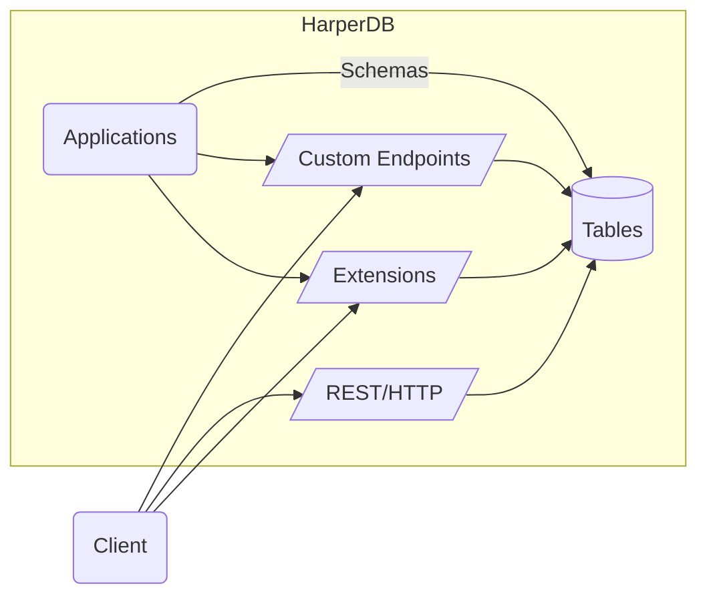

# HarperDB Application Development Guide

+ [Overview](##overview-of-harperdb-applications)
+ [Getting Up and Running](#getting-up-and-running)
+ [Creating Our First Table](#creating-our-first-table)
+ [Adding Attributes to our Table](#adding-attributes-to-our-table)
+ [Adding an Endpoint](#adding-an-endpoint)
+ [Authenticating Endpoints](#authenticating-endpoints)
+ [Querying](#querying)
+ [Deploying your Application](#deploying-your-application)
+ [Understanding the Component Architecture](#understanding-the-component-application-architecture)
+ [Custom Functionality with JavaScript](#custom-functionality-with-javascript)
+ [Define Custom Data Sources](#define-custom-data-sources)
+ [Defining Applications / Components](##configuring-applicationscomponents)
+ [Define Fastify Routes](#define-fastify-routes)
+ [Restarting Your Instance](#restarting-your-instance)


## Overview of HarperDB Applications

HarperDB is more than a database, it's a distributed clustering platform allowing you to package your schema, endpoints and application logic and deploy them to an entire fleet of HarperDB instances optimized for on-the-edge scalable data delivery.

In this guide, we are going to explore the evermore extensible architecture that HarperDB 4.2 and greater provides by building a HarperDB component, a fundamental building-block of the HarperDB ecosystem.

When working through this guide, we recommend you use the [HarperDB Application Template](https://github.com/HarperDB/application-template) repo as a reference.


## Getting up and Running

### Pre-Requisites

We assume you are running HarperDB version 4.2 or greater, which supports HarperDB Application architecture (in previous versions, this is 'custom functions').  

### Scaffolding our Application Directory
Let's create and initialize a new directory for our application, and tell HarperDB to run this as an application.

```shell
$ mkdir my-app && cd my-app  # create directory and step into it
$ git init && npm init -y    # init app as git repo and npm package
$ harperdb run .             # tell HarperDB cli to run current directory as an application
```

## Creating our first Table

The core of a HarperDB application is the database, so let's create a database table!

A quick and expressive way to define a table is through a [GraphQL Schema](https://graphql.org/learn/schema). Using your editor of choice, create a new file named `schema.graphql` in the root of the application directory, `my-app`, that we created above. To create a table, we will need to add a `type` of `@table` named `Dog`: 

```graphql
type Dog @table {
    # properties will go here soon
}
```

And then we'll add a primary key named `id` of type `ID`:

*(Note: A GraphQL schema is a fast method to define tables in HarperDB, but you are by no means required to use GraphQL to query your application, nor should you necessarily do so)*

```graphql
type Dog @table {
	id: ID @primaryKey
}
```

Because we ran `harperdb run .` earlier, HarperDB is now monitoring the contents of our application directory for changes and reloading when they occur.  This means that once we save our schema file with this new `Dog` table defined, HarperDB will automatically reload our application, read `my-app/schema.graphql` and create the `Dog` table and its `id` attribute we just defined. 

This not only creates our table, it also updates our application configuration file `config.yaml` so that the application structure is replicated to each HarperDB instance on deployment. (question: what exactly happens here?)


## Adding Attributes to our Table

Next, let's expand our `Dog` table by adding additional typed attributes for dog `name`, `breed` and `age`.

```graphql
type Dog @table {
	id: ID @primaryKey
	name: String
	breed: String
	age: Int
}
```

This will ensure that new records must have these properties with these types. However, as a NoSQL database, HarperDB supports heterogeneous records (also referred to as documents), so you can freely specify additional properties on any record. If you do want to restrict the records to only defined properties, you can always do that by adding the `sealed` directive:

```graphql
type Dog @table @sealed {
    id: ID @primaryKey
    name: String
    breed: String
    age: Int
}
```

If you are using HarperDB Studio, we can now [add JSON-formatted records](../harperdb-studio/manage-schemas-browse-data.md#add-a-record) to this new table in the studio or upload data as [CSV from a local file or URL](../harperdb-studio/manage-schemas-browse-data.md#load-csv-data). A third, more advanced, way to add data to your database is to use the [operations API](https://api.harperdb.io/), which provides full administrative control over your new HarperDB instance and tables.

## Adding an Endpoint

Now that we have a running application containing a database populated with data, let's make this data accessible from a RESTful URL by adding an endpoint. To do this, we simply add the `@export` directive to our `Dog` table:

```graphql
type Dog @table @export {
    id: ID @primaryKey
    name: String
    breed: String
    age: Int
}
```

By default the application server port is `9926`, so the local URL would be [http://localhost:9926/Dog](http://localhost:9926/Dog). We can PUT or POST data into this table using this new path, and then GET or DELETE from it as well. You can even log into your instance and view or modify data directly from the browser. If you added a record through the studio, you can visit the path `/Dog/<id>` to view that record. Alternately, the curl command `curl http://localhost:9926/Dog/<id>` will achieve the same thing.

## Authenticating Endpoints

These endpoints automatically support multiple forms of authentication like `Basic`, `Cookie`, and `JWT`, as well as the content types `JSON`, `CBOR`, `MessagePack` and `CSV`.

Simply include an `Accept` header in your requests with the preferred content type. We recommend `CBOR` as a compact, efficient encoding with rich data types, but `JSON` is familiar and great for web application development. HarperDB works with other important standard HTTP headers as well, and these endpoints are even capable of caching interaction:
```
Authorization: Basic <base64 encoded user:pass>
Accept: application/cbor
If-None-Match: "etag-id" GMT # browsers can automatically provide this
```

See the documentation on [security](../security/README.md) for more information on different levels of access.

## Querying

Querying your application database is straightforward and easy, as tables exported with the `@export` directive are automatically exposed via REST [endpoints](../rest/README.md). Simple queries can be crafted through [URL query parameters](https://en.wikipedia.org/wiki/Query_string).

As you may know, in order to maintain reasonable query speed on a database as it grows in size, it is critical to select and establish the proper indexes. So, before we add the `@export` declaration to our `Dog` table and begin querying it, let's take a moment to target some table properties for indexing.  We'll use `name` and `breed` as indexed table properties on our `Dog` table. All we need to do to accomplish this is tag these properties with the `@indexed` directive:

```graphql
type Dog @table {
	id: ID @primaryKey
	name: String @indexed
	breed: String @indexed
	owner: String
	age: Int
	tricks: [String]
}
```

And finally, we'll add the `@export` directive to expose the table as a RESTful endpoint

```graphql
type Dog @table @export {
	id: ID @primaryKey
	name: String @indexed
	breed: String @indexed
	owner: String
	age: Int
	tricks: [String]
}
```

Now we can start querying. Again, we just simply access the endpoint with query parameters (basic GET requests), like:
```http
http://localhost:9926/Dog/?name=Harper
http://localhost:9926/Dog/?breed=Labrador
http://localhost:9926/Dog/?breed=Husky&name=Balto&select=id,name,breed
```

Congratulations, you now have created a secure database application backend with a table, a well-defined structure, access controls, and a functional REST endpoint with query capabilities! See the [REST documentation for more information on HTTP access](../rest/README.md) and see the [Schema reference](./defining-schemas.md) for more options for defining schemas.

## Deploying your Application

This guide assumes that you're building a HarperDB application locally.  If you have a cloud instance available, you can deploy it by doing the following:

- commit and push your application component directory code (i.e., the `my-app` directory) to a Github repo
- go to the applications section of your target cloud instance in the [HarperDB Studio](studio.harperdb.io)
- in the left-hand menu of the applications IDE, click 'deploy' and specify a package location reference that follows the [npm package specification](https://docs.npmjs.com/cli/v8/using-npm/package-spec) (i.e., a string like `HarperDB/Application-Template` or a URL like `https://github.com/HarperDB/application-template`, for example, that npm knows how to install).

Once have deployed your application to a HarperDB cloud instance, you can start scaling and expanding your application by adding additional instances in other regions, and expand your deployed mesh.

With the help of a global traffic manager/load balancer configured, you can distribute incoming requests to the appropriate server.
You can deploy and re-deploy your application to all the nodes in your mesh.

Now, with an application that you can deploy, update, and re-deploy, you have an application that is horizontally and globally scalable!

## Understanding the Component Application Architecture

HarperDB can host multiple applications and extensions. Any package that is added to HarperDB is called a "component", and components are generally categorized as "applications", which deliver a set of endpoints for users, and "extensions", which are building blocks for features like authentication, additional protocols, and connectors that can be used by other components. Components can be added to the your hdb/components directory, and all such components will be loaded by HarperDB when it starts (using `harperdb run .` allows us to specifically load a certain application in addition to any that have been added to hdb/components).




## Custom Functionality with JavaScript
So far we have built an application entirely through schema configuration. However, if your application requires more custom functionality, you will probably want to employ your own JavaScript modules to implement more specific features and interactions. This gives you tremendous flexibility and control over how data is accessed and modified in HarperDB. Let's take a look at how we can use JavaScript to extend and define "resources" for custom functionality. Let's add a property to the dog records when they are returned, that includes their age in human years. In HarperDB, data is accessed through our Resource API, a standard interface to access data sources, tables, and make them available to endpoints. Database tables are `Resource` classes, and so extending the function of a table is as simple as extending their class.

To define as resources as endpoints, we need to create a `resources.js` module and then any exported Resource classes are added as an endpoint (this can be done in lieu of, or in addition to, the endpoints defined in the `Query` type in the schema.graphql, but make sure you don't export the same table or resource to the same endpoint/path). Resource classes have methods that correspond to standard HTTP/REST methods, like `get`, `post`, `patch`, and `put` to implement specific handling for any of these methods (for tables they all have default implementations). To do this, we get the `Dog` class from the defined tables, extend it, and export it:

```javascript
// resources.js:
const { Dog } = tables; // get the Dog table from the HarperDB provided set of tables (in the default database)

export class DogWithHumanAge extends Dog {
	get(query) {
		this.humanAge = 15 + dog.age * 5; // silly calculation of human age equivalent
		return super.get(query);
	}
}
```
And now we have a /DogWithHumanAge endpoint just like /Dog, but with the computed `humanAge` property.

Often we may want to incorporate data from other tables or data sources in your data models. Next, let's say that we want a `Breed` table that holds detailed information about each breed, and we want to add that information to the returned dog object. We might define the Breed table as (back in schema.graphql):
```graphql
type Breed @table {
	name: String @primaryKey
	description: String @indexed
	lifespan: Int
	averageWeight: Int
}
```
And next we will use this table in our `get()` method. To do this correctly, we access the table using our current context by passing in `this` as the second argument. This is important because it ensures that we are accessing the data atomically, in a consistent snapshot across tables, it provides automatically tracking of most recently updated timestamps across resources for caching purposes, allows for sharing of contextual metadata (like user who requested the data), and ensure transactional atomicity for any writes (not needed in this get operation, but important for other operations). The resource methods are automatically wrapped with a transaction (will commit/finish when the method completes), and this allows us to fully utilitize multiple resources in our current transaction. With our own snapshot of the database for the Dog and Breed table we can then access data like this:

```javascript
//resource.js:
const { Dog, Breed } = tables; // get the Breed table too
export class DogWithBreed extends Dog {
	async get(query) {
		let breedDescription = await Breed.get(this.breed, this);
		// since breedDescription is not defined on the schema, we need to use set() to add the property 
		this.breedDescription = breedDescription;
		return super.get(query);
	}
}
```

Here we have focused on customizing how we retrieve data, but we may also want to define custom actions for writing data. While HTTP PUT method has a specific semantic definition (replace current record), a common method for custom actions is through the HTTP POST method, which is handled by our Resource's post() method. Let's say that we want to define a POST handler that adds a new trick to the `tricks`  array. We might do it like this, and specify an action to be able to differentiate actions:
```javascript
export class CustomDog extends Dog {
	async post({ data }) {
		if (data.action === 'add-trick')
			this.tricks.push(data.trick);
	}
}
```
The Resource class automatically tracks changes you make to your resource instances and saves those changes when this transaction is committed (again these methods are automatically wrapped in a transaction and committed once the request handler is finished). So when you push data on to the `tricks` array, this will be recorded and persisted when this method finishes and before sending a response to the client.

We can also define custom authorization capabilities. For example, we might want to specify that only the owner of a dog can make updates to a dog. We could add logic to our `post` method or `put` method to do this, but we may want to separate the logic so these methods can be called separately without authorization checks. The Resource API defines `allowRead`, `allowUpdate`, `allowCreate`, and `allowDelete`, or to easily configure individual capabilities. For example, we might do this:
```javascript
export class CustomDog extends Dog {
	allowUpdate(user) {
		return this.owner === user.username;
	}
}
```
Any methods that are not defined will fall back to HarperDB's default authorization procedure based on users' roles. If you are using/extending a table, this is based on HarperDB's [role based access](../security/users-and-roles.md). If you are extending the base `Resource` class, the default access requires super user permission.

You can also use the `default` export to define the root path resource handler. For example:
```javascript
// resources.json
export default class CustomDog extends Dog {
	...
```
This will allow requests to url like /<record-id> to be directly resolved to this resource.

## Define Custom Data Sources
We can also directly implement the Resource class and use it to create new data sources from scratch that can be used as endpoints. Custom resources can also be used as caching sources. Let's say that we defined a `Breed` table that was a cache of information about breeds from another source. We could implement a caching table like:
```javascript
const { Breed } = tables; // our Breed table
class BreedSource extends Resource { // define a data source
	async get() {
		return (await fetch(`http://best-dog-site.com/${this.getId()}`)).json();
	}
}
// define that our breed table is a cache of data from the data source above, with a specified expiration
Breed.sourcedFrom(BreedSource, { expiration: 3600 });
```

The [caching documentation](caching.md) provides much more information on how to use HarperDB's powerful caching capabilities and set up data sources.

HarperDB provides a powerful JavaScript API with significant capabilities that go well beyond a "getting started" guide. See our documentation for more information on using the [`globals`](../reference/globals.md) and the [Resource interface](../reference/resource.md).

## Configuring Applications/Components
Every application or component can define their own configuration in a `config.yaml`. If you are using the application template, you will have a [default configuration in this config file](https://github.com/HarperDB/application-template/blob/main/config.yaml) (which is default configuration if no config file is provided). Within the config file, you can configure how different files and resources are loaded and handled. The default configuration file itself is documented with directions. Each entry can specify any `files` that the loader will handle, and can also optionally specify what, if any, URL `path`s it will handle. A path of `/` means that the root URLs are handled by the loader, and a path of `.` indicates that the URLs that start with this application's name are handled.

This config file allows you define a location for static files, as well (that are directly delivered as-is for incoming HTTP requests).

Each configuration entry can have the following properties, in addition to properties that may be specific to the individual component:
* `files`: This specifies the set of files that should be handled the component. This is a glob pattern, so a set of files can be specified like "directory/**".
* `path`: This is the URL path that is handled by this component.
* `root`: This specifies the root directory for mapping file paths to the URLs. For example, if you want all the files in `web/**` to be available in the root URL path via the static handler, you could specify a root of `web`, to indicate that the web directory maps to the root URL path.
* `package`: This is used to specify that this component is a third party package, and can be loaded from the specified package reference (which can be an NPM package, Github reference, URL, etc.).

## Define Fastify Routes
Exporting resource will generate full RESTful endpoints. But, you may prefer to define endpoints through a framework. HarperDB includes a resource plugin for defining routes with the Fastify web framework. Fastify is a full-featured framework with many plugins, that provides sophisticated route definition capabilities.

By default, applications are configured to load any modules in the `routes` directory (matching `routes/*.js`) with Fastify's autoloader, which will allow these modules to export a function to define fastify routes. See the [defining routes documentation](../applications/define-routes.md) for more information on how to create Fastify routes.

However, Fastify is not as fast as HarperDB's RESTful endpoints (about 10%-20% slower/more-overhead), nor does it automate the generation of a full uniform interface with correct RESTful header interactions (for caching control), so generally the HarperDB's REST interface is recommended for optimum performance and ease of use.

## Restarting Your Instance

Generally, HarperDB will auto-detect when files change and auto-restart the appropriate threads. However, if there are changes that aren't detected, you may manually restart, with the `restart_service` operation:

```json
{
    "operation": "restart_service",
    "service": "http_workers"
}
```
