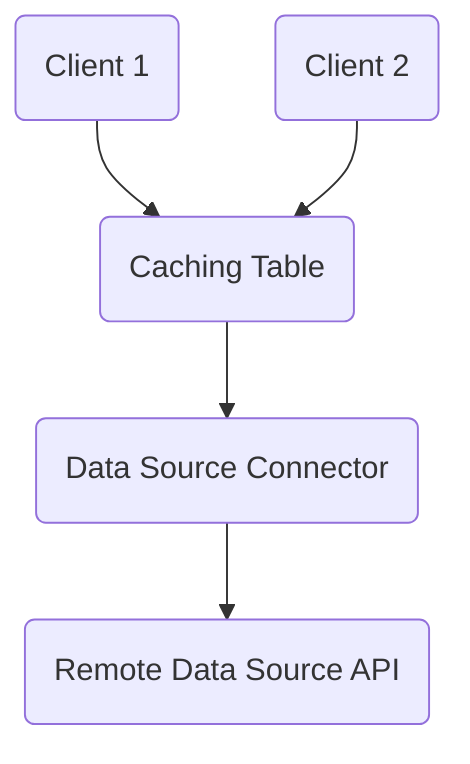

# Why Cache with HarperDB

HarperDB has integrated support for caching data. With built-in caching capabilities and distributed high-performance low-latency responsiveness, HarperDB makes an ideal data caching server. HarperDB can store cached data as queryable structured data, so data can easily be consumed in one format (for example JSON or CSV) and provided to end users in different formats with different selected properties (for example MessagePack, with a subset of selected properties), or even with customized querying capabilities. HarperDB also manages and provides timestamps/tags for proper caching control, facilitating further downstreaming caching. With these combined capabilities, HarperDB is an extremely fast, interoperable, flexible, and customizable caching server.

## Configuring Caching
To setup caching, first you will need to define a table that you will use as your cache (to store the cached data). You can review the [introduction to building applications](../applications/README.md) for more information on setting up the application (and the [defining schemas documentation](../reference/defining-schemas.md)), but once you have defined an application folder with a schema, you can add a table for caching to your `schema.graphql`:
```graphql
type MyCache @table(expiration: 3600) @export {
    id: ID @primaryKey
}
```

You may also note that we can define an time-to-live (TTL) expiration on the table, indicating when table records/entries should expire. This is generally necessary for "passive" caches where there is no active notification of when entries expire. However, this is not needed if you provide a means of notifying when data is invalidated and changed.

## Define External Data Source
Next, you need to define the source for your cache. External data sources could be HTTP APIs, other databases, microservices, or any other source of data. This can be defined as resource class in your application's `resources.js` module. You can extend the `Resource` class (which is available as a global variable in the HarperDB environment) as your base class. The first method to implement is a `get()` method to define how to retrieve the source data. For example, if we were caching an external HTTP API, we might define it as such:
```javascript
class ThirdPartyAPI extends Resource {
	async get() {
		return (await fetch(`http://some-api.com/${this.getId()}`)).json();
	}
}
```
Next, we define this external data resource as the "source" for the caching table we defined above:
```javascript
const { MyTable } = tables;
MyTable.sourcedFrom(ThirdPartyAPI);
```

Now we have a fully configured and connected cache. If you access data from `MyCache` (for example, through the REST API, like `/MyCache/some-id`), HarperDB will check to see if the requested entry is in the table and return it if it is available (and hasn't expired). If there is no entry, or it has expired (it is older than one hour in this case), it will go to the source, calling the `get()` method, which will then retrieve the requested entry. Once the entry is retrieved, it will be saved/cached in the caching table (for one hour based on our expiration time).



HarperDB handles waiting for an existing cache resolution to finish and use its result. This prevents a "cache stampede" when entries expire, ensuring that multiple requests to a cache entry will all wait on a single request to the data source (note that HarperDB uses a very fast non-locking method which improves the performance of caching, but occassionaly this may allow multiple concurrent requests for one entry, but this is rare and amortizes to negligible extra requests in most situations).

Cache tables with an expiration are periodically pruned for expired entries. Because this is done periodically, there is usually some amount of time between when a record has expired and when record is actually evicted (the cached data is removed). But when a record is checked for availability, the expiration time is used to determine if the record is fresh (and the cache entry can be used).

### Eviction with Indexing
Eviction is the removal of a locally cached copy of data, but it does not (semantically) represent a "deletion" of the actual data. If a caching table uses expiration (and eviction), and has indexing on certain attributes, the indexes that reference the evicted record are preserved, along with the attribute data necessary to maintain these indexes. Therefore eviction means the removal of non-indexed data (in this case evictions are stored as "partial" records). If a search query is performed that matches this evicted record, the record will be requested on-demand to fufill the search query.

### Specifying a Timestamp
In the example above, we simply retrieved data to fulfill a cache request. We may want to supply the timestamp of the record we are fulfilling as well. This can be set on the context for the request:
```javascript
class ThirdPartyAPI extends Resource {
	async get() {
		let response = await fetch(`http://some-api.com/${this.getId()}`);
        this.getContext().lastModified = response.headers.get('Last-Modified');
        return response.json();
	}
}
```

## Active Caching and Invalidation
The cache we have created above is a "passive" cache; it only pulls data from the data source as needed, and has no knowledge of if and when data from the data source has actually changed, so it must rely on timer-based expiration to periodically retrieve possibly updated data. This means that it possible that the cache may have stale data for a while (if the underlying data has changed, but the cached data hasn't expired), and the cache may have to refresh more than necessary if the data source data hasn't changed. Consequently it can be significantly more effective to implement an "active" cache, in which the data source is monitored and notifies the cache when any data changes. This ensures that when data changes, the cache can immediately load the updated data, and unchanged data can remain cached much longer (or indefinitely).

### Invalidate
One way to provide more active caching is to specifically invalidate individual records. Invalidation is useful when you know the source data has changed, and the cache needs to re-retrieve data from the source the next time that record is accessed. This can be done by executing the `invalidate()` method on a resource. For example, you could extend a table (in your resources.js) and provide a custom POST handler that does invalidation:
```javascript
const { MyTable } = tables;
export class MyTableEndpoint extends MyTable {
    async post(data) {
        if (data.invalidate) // use this flag as a marker
            this.invalidate();
    }
}
```
(Note that if you are now exporting this endpoint through resources.js, you don't necessarily need to directly export the table separately in your schema.graphql).

### Subscriptions
We can provide more control of an active cache with subscriptions. If there is a way to receive notifications from the external data source of data hcnages, we can implement this data source as an "active" data source for our cache by implementing a `subscribe` method. A `subscribe` method should return an asynchronous iterable, that iterates and returns events indicating the updates. One straightforward way of creating an asynchronous iterable is by defining the `subscribe` method as an asynchronous generator. If we had an endpoint that we could poll for changes, we could implement this like:
```javascript
class ThirdPartyAPI extends Resource {
    async *subscribe() {
        do {
            // get the next data change event from the source
            let update = (await fetch(`http://some-api.com/latest-update`)).json();
            const event = { // define the change event (which will update the cache)
                type: 'put', // this would indicate that the event includes the new data value
                id: // the primary key of the record that updated
                value: // the new value of the record that updated
                timestamp: // the timestamp of when the data change occurred
            };
            yield event; // this returns this event, notifying the cache of the change
        } while(true);
    }
	async get() {
...
```
Notification events should always include an `id` to indicate the primary key of the updated record. The event should have a `value` for `put` and `message` event types. The `timestamp` is optional and can be used to indicate the exact timestamp of the change. The following event `type`s are supported:
* `put` - This indicates that the record has been updated and provides the new value of the record
* `invalidate` - Alternately, you can notify with an event type of `invalidate` to indicate that the data has changed, but without the overhead of actually sending the data (the `value` property is not needed), so the data only needs to be sent if and when the data is requested through the cache. An `invalidate` will evict the entry and update the timestamp to indicate that there is new data that should be requested (if needed).
* `delete` - This indicates that the record has been deleted.
* `message` - This indicates a message is being passed through the record. The record value has not changed, but this is used for [publish/subscribe messaging](../real-time/).
* `transaction` - This indicates that there are multiple writes that should be treated as a single atomic transaction. These writes should be included as an array of data notification events in the `writes` property.

With an active external data source with a `subscribe` method, the data source will proactively notify the cache, ensuring a fresh and efficient active cache. Note that with an active data source, we still use the `sourcedFrom` method to register the source for a caching table, and the table will automatically detect and call the subscribe method on the data source.

By default, HarperDB will only run the subscribe method on one thread. HarperDB is multi-threaded and normally runs many concurrent worker threads, but typically running a subscription on multiple threads can introduce overlap in notifications and race conditions and running on a subscription on a single thread is preferable. However, if you want to enable subscribe on multiple threads, you can define a `static subscribeOnThisThread` method to specify if the subscription should run on the current thread:
```javascript
class ThirdPartyAPI extends Resource {
    static subscribeOnThisThread(threadIndex) {
        return threadIndex < 2; // run on two threads (the first two threads)
    }
    async *subscribe() {
        ....
```

An alternative to using asynchronous generators is to use a subscription stream and send events to it. A default subscription stream (that doesn't generate its own events) is availabe from the Resource's default subscribe method:
```javascript
class ThirdPartyAPI extends Resource {
    subscribe() {
        const subscription = super.subscribe();
        setupListeningToRemoteService().on('update', (event) => {
            subscription.send(event);
        });
        return subscription;
    }
}
```

## Downstream Caching
It is highly recommended that you utilize the [REST interface](../rest/README.md) for accessing caching tables, as it facilitates downstreaming caching for clients. Timestamps are recorded with all cached entries. Timestamps are then used for incoming [REST requests to specify the `ETag` in the response](../rest/README.md#cachingconditional-requests). Clients can cache data themselves and send requests using the `If-None-Match` header to conditionally get a 304 and preserve their cached data based on the timestamp/`ETag` of the entries that are cached in HarperDB. Caching tables also have [subscription capabilities](#subscribing-to-caching-tables), which means that downstream caches can be fully "layered" on top of HarperDB, both as passive or active caches.

## Write-Through Caching
The cache we have defined so far only has data flowing from the data source to the cache. However, you may wish to support write methods, so that writes to the cache table can flow through to underlying canonical data source, as well as populate the cache. This can be accomplished by implementing the standard write methods, like `put` and `delete`. If you were using an API with standard RESTful methods, you can pass writes through to the data source like this:
```javascript
class ThirdPartyAPI extends Resource {
    async put(data) {
        await fetch(`http://some-api.com/${this.getId()}`, {
            method: 'PUT',
            body: JSON.stringify(data)
        });
    }
    async delete() {
        await fetch(`http://some-api.com/${this.getId()}`, {
            method: 'DELETE',
        });
    }
    ...
```
When doing an insert or update to the MyCache table, the data will be sent to the underlying data source through the `put` method and the new record value will be stored in the cache as well.

### Subscribing to Caching Tables
You can subscribe to a caching table just like any other table. The one difference is that normal tables do not usually have `invalidate` events, but an active caching table may have `invalidate` events. Again, this event type gives listeners an opportunity to choose whether or not to actually retrieve the value that changed.

### Caching with Replication
Caching tables can be configured to replicate in HarperDB clusters. When replicating caching tables, there are a couple of options. If each node will be separately connecting to the data source and you do not need the subscription data notification events to replicate, you can set the `replicationSource` to `false`. In this case, only data requests (that come through standard requests like REST interface or operations API), will be replicated. However, if you data notification will only be delivered to a single node (at once) and you need the subscription data notification events to replicate, you can set the `replicationSource` to `true` and the incoming events from the subscription will be replicated to all other nodes:
```javascript
MyTable.sourcedFrom(ThirdPartyAPI, { replicationSource: true });
```