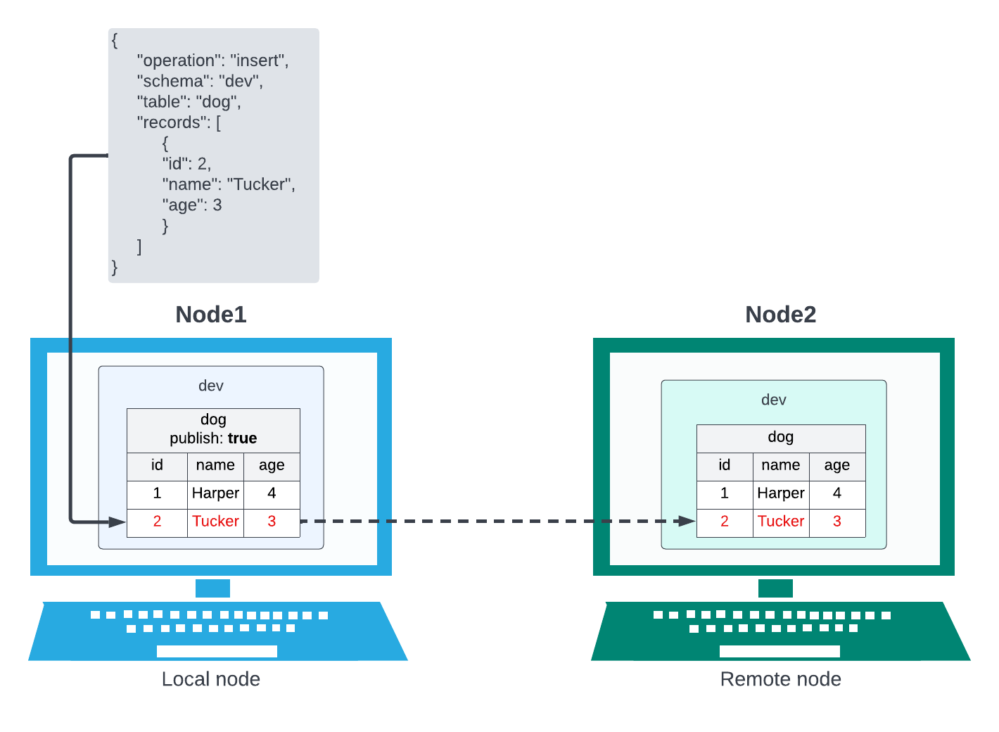
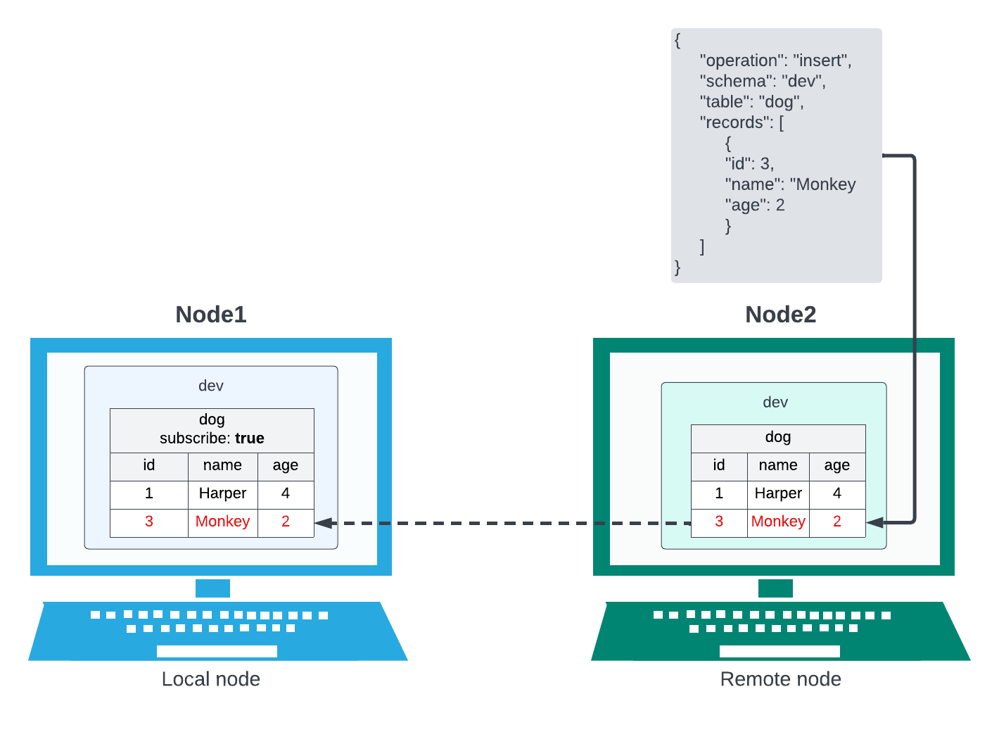
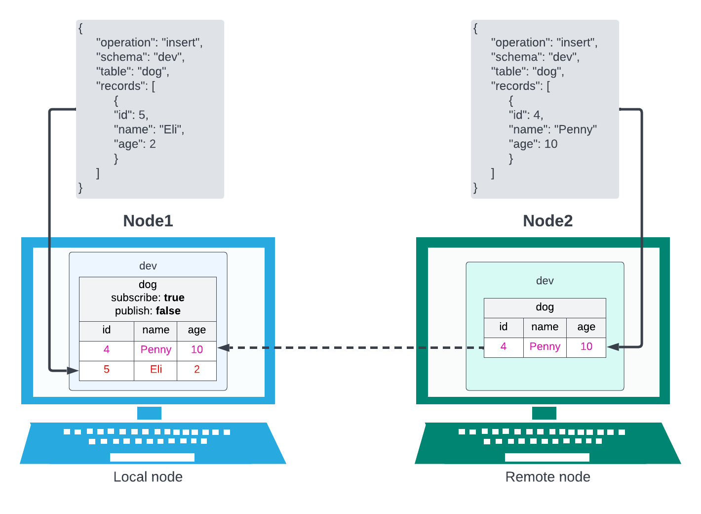
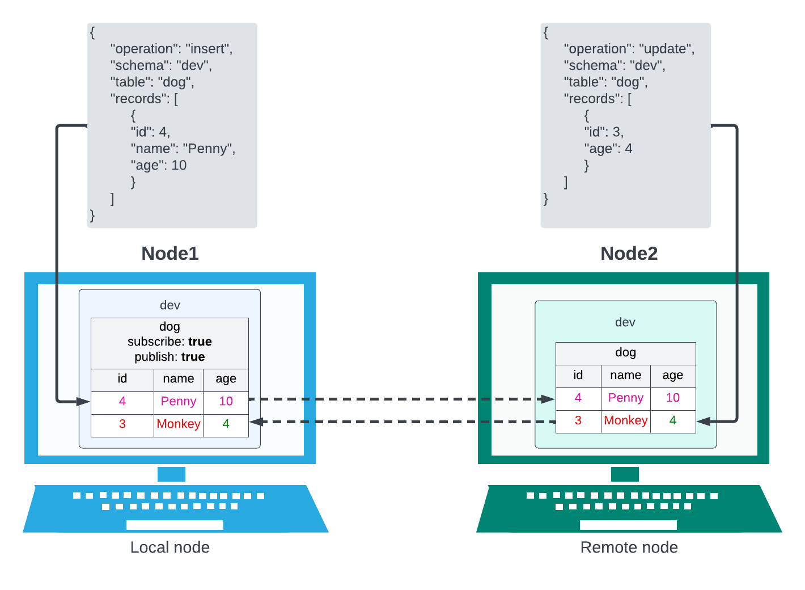

# Subscriptions

A subscription defines how data should move between two nodes. They are exclusively table level and operate independently. They connect a table on one node to a table on another node, the subscription will apply to a matching schema name and table name on both nodes.

_Note: ‘local’ and ‘remote’ will often be referred to. In the context of these docs ‘local’ is the node that is receiving the API request to create/update a subscription and remote is the other node that is referred to in the request, the node on the other end of the subscription._

A subscription consists of:

`schema` - the name of the schema that the table you are creating the subscription for belongs to. 

`table` - the name of the table the subscription will apply to. 

`publish` - a boolean which determines if transactions on the local table should be replicated on the remote table. 

`subscribe` - a boolean which determines if transactions on the remote table should be replicated on the local table.

#### Publish subscription

This diagram is an example of a `publish` subscription from the perspective of Node1.

The record with id 2 has been inserted in the dog table on Node1, after it has completed that insert it is sent to Node 2 and inserted in the dog table there.

#### Subscribe subscription

This diagram is an example of a `subscribe` subscription from the perspective of Node1.

The record with id 3 has been inserted in the dog table on Node2, after it has completed that insert it is sent to Node1 and inserted there.

#### Subscribe and Publish

This diagram shows both subscribe and publish but publish is set to false. You can see that because subscribe is true the insert on Node2 is being replicated on Node1 but because publish is set to false the insert on Node1 is _**not**_ being replicated on Node2.

This shows both subscribe and publish set to true. The insert on Node1 is replicated on Node2 and the update on Node2 is replicated on Node1.
