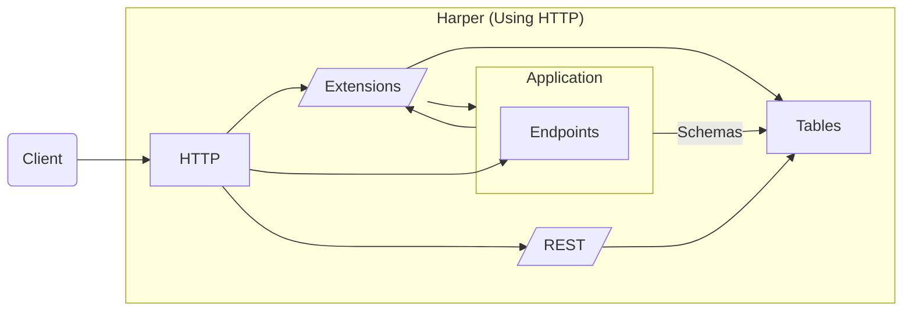

# Applications

## Overview of Harper Applications

Harper is a distributed clustering platform allowing you to package your schema, endpoints and application logic and deploy them to an entire fleet of Harper instances optimized for on-the-edge scalable data delivery.

In this guide, we are going to explore the extensible architecture that Harper provides by building a Harper component, a fundamental building-block of the Harper ecosystem.

When working through this guide, we recommend you use the [Harper Application Template](https://github.com/HarperDB/application-template) repo as a reference.

## Understanding the Component Application Architecture

Harper provides several types of components. Any package that is added to Harper is called a "component", and components are generally categorized as either "applications", which deliver a set of endpoints for users, or "extensions", which are building blocks for features like authentication, additional protocols, and connectors that can be used by other components. Other systems might call this "middleware." A simplified modle for an HTTP use case looks like: 



## Getting up and Running

### Pre-Requisites

We assume you are running Harper version 4.2 or greater, which supports Harper Application architecture (in previous versions, this is 'custom functions').

### Scaffolding our Application Directory

Let's create and initialize a new directory for our application. It is recommended that you start by using the [Harper application template](https://github.com/HarperDB/application-template). Assuming you have `git` installed, you can create your project directory by cloning:

```shell
> git clone https://github.com/HarperDB/application-template my-app
> cd my-app
```

<details>

<summary>You can also start with an empty application directory if you'd prefer.</summary>

To create your own application from scratch, you'll may want to initialize it as an npm package with the \`type\` field set to \`module\` in the \`package.json\` so that you can use the EcmaScript module syntax used in this tutorial:

```shell
> mkdir my-app
> cd my-app
> npm init -y esnext
```

</details>

<details>

<summary>If you want to version control your application code, you can adjust the remote URL to your repository.</summary>

Here's an example for a github repo:

```shell
> git remote set-url origin git@github.com:/<github-user>/<github-repo> 
```

Locally developing your application and then committing your app to a source control is a great way to manage your code and configuration, and then you can [directly deploy from your repository](./#deploying-your-application).

## The Application Configuration: `config.yaml`

Before we jump into writing code, let's take a quick look at the `config.yaml` file that is part of the Application Template. This file tells the Harper core what extensions (built-in or your own) to run and in what order.  This is effectively a stack of middleware.  Each extension has an opportunity to handle or modify the request as it passes through.  You will see below that your application code actually runs inside an extension!  Here is the provided file:

```yaml
rest: true           
graphqlSchema:       
  files: '*.graphql' 
jsResource: 
  files: resources.js 
static: 
  root: web
  files: web/**
roles: 
  files: roles.yaml
```

</details>

Let's go through this item by item.  All of these extensions will be defined in detail below in this document.

### rest

This served two purposes, it provided a RESTful interface to the tables you define as well as to your application endpoints defined below.  

### graphqlSchema

This takes the referenced graphql file(s) and autogenerates the referenced databases and tables. As you will see below, this is a powerful and simple way to spin up your data infrastructure.

## jsResource

The extension that loads and connections your application code. 

## static

Defines where to find the files that you want served directly, without any processing.

## roles

Defines the permissions to your data and endpoints

## Time to say "Hello"

The Application Template has a file called `resource.js`.  We see above in the `config.yaml` that this is loaded by the `jsResource` extension. This extension is the heart of exposing your application code to the world. It goes through and loads your javascript file (or files) and using the `rest` extensions, creates endpoints for each exposed `Resource`. We'll discuss Resources below.  

```javascript
export class Greeting extends Resource {
  get() {
    return { greeting: 'Hello, world!' };
  }
}
```

In your `my-app` directory run Harper:

```shell
> harperdb run . # tell Harper cli to run current directory as an application
```

This is a quick and easy way to run you application without bundining it into a component and installed.  Well, without YOU having to do it. The command takes care of that for you.

Now, make an HTTP request to your runnign application.  Note that the default port that harper listens on is 9926 which can be [configured here](../../deployments/configuration.md#http):

```shell
> curl -i http://127.0.0.1:9926/Greeting

HTTP/1.1 200 OK
Vary: Accept, Accept-Encoding
Content-Type: application/json
...snip headers...

{"greeting":"Hello, world!"}
```

### Make it Interactive

Let's change who we say hello to based on the URL query string.

The `get` method endpoints is passed a `query` object:

```javascript
export class Greeting extends Resource {
 get(query) {
   const name = query.get('name') || 'world'
   return { greeting: `Hello, ${name}!` };
 }
}
```

Stop and start harper and send the request:

```shell
> curl -i http://127.0.0.1:9926/Greeting?name=Harper

HTTP/1.1 200 OK
Vary: Accept, Accept-Encoding
Content-Type: application/json
...snip headers...

{"greeting":"Hello, Harper!"}
```

> [!NOTE]
> 
> Rather than restarting harper every time you update your javascript files, you can run `harperdb dev .`. The dev mode monitors files in the application and will restart the component threads when it sees an update.  We will work with this in the next section.  Some changes, such as extention updates or logging changes might still require a full stop and start.

## Creating our first Table

Code without data to back it up tends to have limited value.  Luckily a core part of a Harper application is the database, so let's create a database table!

A quick and expressive way to define a table is through a [GraphQL Schema](https://graphql.org/learn/schema). This leverages the built in extension called, appropriately, 'graphqlSchema'.  Using your editor of choice, edit the file named `schema.graphql` in the root of the application directory, `my-app`, that we created above. To create a table, we will need to add a `type` of `@table` named `Dog` (and you can remove the example table in the template):

```graphql
type Dogs @table {
    # properties will go here soon
}
```

And then we'll add a primary key named `id` of type `ID`. Additionally, let's give out database an explicit name, `pets`:

_(Note: A GraphQL schema is a fast method to define tables in Harper, but you are by no means required to use GraphQL to query your application, nor should you necessarily do so)_

```graphql
type Dogs @table(database: "pets") {
    id: ID @primaryKey
}
```

Now we tell Harper to run this as an application:

```shell
> harperdb dev . # tell Harper cli to run current directory as an application in dev mode
```

Harper will now create the `Dog` table and its `id` attribute we just defined. Not only is this an easy way to create a table, but this schema is included in our application, which will ensure that this table exists wherever we deploy this application (to any Harper instance).

## Adding Attributes to our Table

Next, let's expand our `Dog` table by adding additional typed attributes for dog `name`, `breed` and `age`.

```graphql
type Dogs @table(database: "pets") {
    id: ID @primaryKey
    name: String
    breed: String
    age: Int
}
```

This will ensure that new records must have these properties with these types.

Because we ran `harperdb dev .` earlier (dev mode), Harper is now monitoring the contents of our application directory for changes and reloading when they occur. This means that once we save our schema file with these new attributes, Harper will automatically reload our application, read `my-app/schema.graphql` and update the `Dog` table and attributes we just defined. The dev mode will also ensure that any logging or errors are immediately displayed in the console (rather only in the log file).

As a document database, Harper supports heterogeneous records, so you can freely specify additional properties on any record. If you do want to restrict the records to only defined properties, you can always do that by adding the `sealed` directive:

```graphql
type Dogs @table(database: "pets") @sealed {
    id: ID @primaryKey
    name: String
    breed: String
    age: Int
    tricks: [String]
}
```

If you are using Harper Studio, we can now [add JSON-formatted records](../../administration/harper-studio/manage-databases-browse-data.md#add-a-record) to this new table in the studio or upload data as [CSV from a local file or URL](../../administration/harper-studio/manage-databases-browse-data.md#load-csv-data). A third, more advanced, way to add data to your database is to use the [operations API](../operations-api/), which provides full administrative control over your new Harper instance and tables.  We are going to use a fourth method, the capabilties exposed by the built-in`rest` extension, in the next section.

## Adding a Endpoint with REST

Now that we have a running application with a database, let's make this data accessible from a RESTful URL by adding an endpoint. To do this, we simply add the `@export` directive to our `Dog` table:

```graphql
type Dogs @table(database: "pets") @export {
    id: ID @primaryKey
    name: String
    breed: String
    age: Int
    tricks: [String]
}
```

By default the application HTTP server port is `9926` (this can be [configured here](../../deployments/configuration.md#http)), so the local URL would be [http://localhost:9926/Dogs/](http://localhost:9926/Dogs/) with a full REST API. We can PUT or POST data into this table using this new path, and then GET or DELETE from it as well (you can even view data directly from the browser). If you have not added any records yet, we could use a PUT or POST to add a record. PUT is appropriate if you know the id, and POST can be used to assign an id:

```http
POST /Dogs/
Content-Type: application/json

{
    "name": "Harper",
    "breed": "Labrador",
    "age": 3,
    "tricks": ["sits"]
}
```

An example curl command woule be:

```shell
curl -i http://127.0.0.1:9926/Dogs/ --header 'Content-type: application/json' -d '{"name":"Harper","breed":"Labrador","age":3,"tricks":["sits"]}'
```

With this a record will be created and the auto-assigned id will be available through the `Location` header. If you added a record, you can visit the path `/Dogs/<id>` to view that record. Alternately, the curl command:

```shell
curl http://127.0.0.1:9926/Dogs/<id>
```

Or to see all of the records in the table:

```shell
curl http://127.0.0.1:9926/Dogs/
```

## Back to the Application

So now we know how to spin up an application endpoint, create a data table, and populate it with data. Let's combine then into something more than the sum of its parts.

### Populate the Data

Before we start out, let's clear the Dog table and populate it with a few records:

```shell
curl -X DELETE http://127.0.0.1:9926/Dogs/
```

Here is some data that you can uload via `curl`

```shell
'{"name":"Harper","breed":"Labrador","age":3,"tricks":["sits"]}'
'{"name":"Perth","breed":"Labrador","age":9,"tricks":["guidedog"]}'
'{"name":"Elfie","breed":"Golden Retriever","age":4,"tricks":["sits","stays"]}'
```

`POST` them with:

```shell
curl http://127.0.0.1:9926/Dogs/ <ContentType Header> -d <data line>
```

See above for an example.

Now we should have three records in our table!  That sound like enough for a robust application.

### Building the App

Let's have our application do three things:

- Return the average age of the dogs in the table

- Return a list of all of the tricks our dogs can perform

- Teach a dog a new trick

We will put these endpoints at:

```
/dogs/average
/dogs/tricks
/dogs/teachnewtrick
```

Here is our `get` method for `dogs`:

```javascript
export class dogs extends Resource {
  get(query) {
    const command = this.getId()

    switch( command ) {
    case 'average':
      return calculateAverageAge()
    case 'tricks':
      return getTricks()
    case 'newtrick':
      return teachNewTrick(query)
    }
  }
}
```

Here we use `this.getId()` to get the `id` of the request.  In REST this is generally the first path parameter indicating the id of the object we want to act on.  Here we are using it to parse out the 'verb' we want to execute.  

Before we go any further, lets get access to the `Dogs` table:

```javascript
import { Dogs } from databases.pets
```

`databases` is a global object that Harper exposes that represents all of the databases you have access to. You will remember that above we called out database `pets` in the graphql schema.

Here is how we can implement `calculateAvergaAge`:

```javascript
async function calculateAverageAge() {
  # Retrieve the age column from all records
  const records = await Dogs.get({
    select: [ 'age' ]
  })

  let total = 0
  let n = 0

  for await ( const dog of records ) {
    total += dog.age
    n++
  }

  # Returning non-null creates a 200 response
  return { 'averageAge': (total/n).toFixed(2) }
}
```

There are a few things to note here:

- We use the `Dogs` table's `get` method to get all of the records, limiting only to the `age` columns that we care about.  `get` and it's equivalent `search` take a `Query` object that provides fine grained control over what is fetched.  There is very complete [documention](https://docs.harperdb.io/docs/technical-details/reference/resource#patch-recordupdate-object-context-resource-or-context-promise-less-than-void-greater-than) on its use.

- `Dogs.get` returns an `asyncIterator`. We have to `await` the for loop where we walk through the records.

- By returning non null, we implcitly return a 200 response with the JSON.stringified object.

Try it out (restart Harper is you are not runnign under `dev`):

```shell
> curl http://127.0.0.1/dogs/average

HTTP/1.1 200 OK
Content-Type: application/json
...

{"averageAge":"5.33"}
```

Now for `getTricks`

```javascript
async function getTricks() {
  # Get all records and columns
  const records = await Dogs.get([])

  const tricks = []

  # Iterate over the asyncIterator and get the unique tricks
  for await ( const dog of records ) {
    for ( const trick of dog.tricks ) {
      if ( ! tricks.includes(trick) ) {
        tricks.push(trick)
      }
    }
  }

  # return a 200
  return { tricks }
}
```

Passing the empty `[]` to `Dogs.get` returns all of the table contents.

Finally, `teachNewTrick`

```javascript
async function teachNewTrick( query ) {
  # Get the query prameters for name and trick
  const name = query.get('name')
  const trick = query.get('trick')

  # No trick?  Return a 400
  if ( ! trick ) {
    return { status: 400, headers: {}, data: { error: "No trick listed" } }
  }

  # Perform the search based on the dog name
  const records = await Dogs.search({
    conditions: [
      { attribute: 'name', value: name }
    ]
  })

  # Use fromAsync to get the async records
  const dogs = await Array.fromAsync( records )
  const dog = dogs[0] # There might be more than one dog with that name!

  # If we did not find a dog, return a 404
  if ( ! dog ) {
    return { status: 404, headers: {} }
  }

  # Another error if the do is too old to learn
  if ( dog.age > 8 ) {
    return { status: 400, 
             headers: {}, 
             data: { error: "Can't teach an old dog new tricks" } }
  }

  # add the new trick to the list (no duplicate check)
  const tricks = [ ...dog.tricks, trick ]

  # Call patch with the record id to just update the tricks
  await Dogs.patch( dog.id, { tricks } )

  # Return a sucessful 'No Content' response
  return { status: 204, headers: {} }
}
```

There you have it.  A 'complete' app for managing you dogs. Hopefully this helped illustrate how the application code and data model can interact and help you build your truly complete applications.

There is a LOT more to cover, but this should get you started.  For more infromation go 'here', 'here', 'here', and 'here', etc.

## Authenticating Endpoints

The REST endpoints we created above automatically support `Basic`, `Cookie`, and `JWT` authentication methods. See the documentation on [security](../security/) for more information on different levels of access.

However, the endpoints that are created by just extending the `Resource` class need a bit more work.  Let's go back to our `dogs` endpoint:

```javascript
export class dogs extends Resource {
  get(query) {
    ...
  }
}
```

As written, we will get a `403` error when we try to access this from something other then `localhost` (see the Note below).  There are two options for poperly handingling this.  The first is the have `dogs` extend `databases.pets.Dogs`:

```javascript
export class dogs extends databases.pets.Dogs {
  get(query) {
    ...
  }
}
```

`databases` is a global that is expoerted to your Application by default that contains all of the databases you have access to currently in the Harper stack, `pets` is what we called our database, and `Dogs` is the name of our table, which is an instance of `TableResource` which is a `Resource`.  Thus, you are adding functionality directly to the `Table` object that already has the REST based permissions mentioned above.

This is extremely convenient but it is not always what you want.  These is where the CRUD based `allow` calls come in:

- `allowCreate( user, data, context )`

- `allowRead( user, query, context )`

- `allowUpdate( user, data, context )`

- `allowDelete( user, query, context )`

There calls will return `true` if the request should be allowed and `false` if not.  In our case we are performing a `get` which is a read operation so we need to provide an `allowRead`:

```javascript
  allowRead( user, query, context ) {
    return <Perform auth check here>
  }
```

What should that auth check be?  It depends on your appliction.  Maybe you check the session cookie?  Or an `Authorize` header?  A cute thing to do would be:

```javascript
### Does not work as written
allowRead( user, query, context ) { # This code is incomplete!!!
  let redirect = await RedirectTable.get(id)
  let isAllowed = redirect.allowRead(user);
  return isAllowed
}
```

This gives you the exact behavior as if you extended `databases.pets.Dogs`.  Which implies is it probably easier to do just that.

> [!NOTE]
> 
> By default, Harper also automatically authorizes all requests from loopback IP addresses (from the same computer) as the superuser, to make it simple to interact for local development. If you want to test authentication/authorization, or enforce stricter security, you may want to disable the [`authentication.authorizeLocal` setting](../../deployments/configuration.md#authentication).


## Deploying your Application

This guide assumes that you're building a Harper application locally. If you have a cloud instance available, you can deploy it by doing the following:

* Commit and push your application component directory code (i.e., the `my-app` directory) to a Github repo. In this tutorial we started with a clone of the application-template. To commit and push to your own repository, change the origin to your repo: `git remote set-url origin git@github.com:your-account/your-repo.git`
* Go to the applications section of your target cloud instance in the [Harper Studio](../../administration/harper-studio/manage-applications.md).
* In the left-hand menu of the applications IDE, click 'deploy' and specify a package location reference that follows the [npm package specification](https://docs.npmjs.com/cli/v8/using-npm/package-spec) (i.e., a string like `HarperDB/Application-Template` or a URL like `https://github.com/HarperDB/application-template`, for example, that npm knows how to install).

You can also deploy your application from your repository by directly using the [`deploy_component` operation](../operations-api/components.md#deploy-component).

Once you have deployed your application to a Harper cloud instance, you can start scaling your application by adding additional instances in other regions.

With the help of a global traffic manager/load balancer configured, you can distribute incoming requests to the appropriate server. You can deploy and re-deploy your application to all the nodes in your mesh.

Now, with an application that you can deploy, update, and re-deploy, you have an application that is horizontally and globally scalable!

## Restarting Your Instance

Generally, Harper will auto-detect when files change and auto-restart the appropriate threads. However, if there are changes that aren't detected, you may manually restart, with the `restart_service` operation:

```json
{
    "operation": "restart_service",
    "service": "http_workers"
}
```
