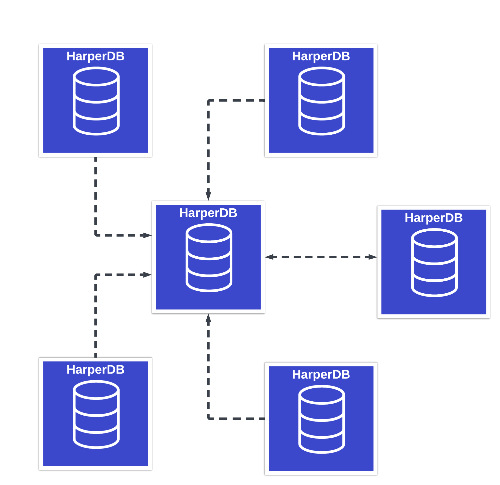

# Things Worth Knowing

Additional information that will help you define your clustering topology.

***

### Transactions

Transactions that are replicated across the cluster are:

* Insert
* Update
* Upsert
* Delete
* Bulk loads
  * CSV data load
  * CSV file load
  * CSV URL load
  * Import from S3

When adding or updating a node any schemas and tables in the subscription that don’t exist on the remote node will be automatically created.

**Destructive schema operations do not replicate across a cluster**. Those operations include `drop_schema`, `drop_table`, and `drop_attribute`. If the desired outcome is to drop schema information from any nodes then the operation(s) will need to be run on each node independently.

Users and roles are not replicated across the cluster.

***

### Queueing

HarperDB has built-in resiliency for when network connectivity is lost within a subscription. When connections are reestablished, a catchup routine is executed to ensure data that was missed, specific to the subscription, is sent/received as defined.

***

### Topologies

HarperDB clustering creates a mesh network between nodes giving end users the ability to create an infinite number of topologies. subscription topologies can be simple or as complex as needed.

