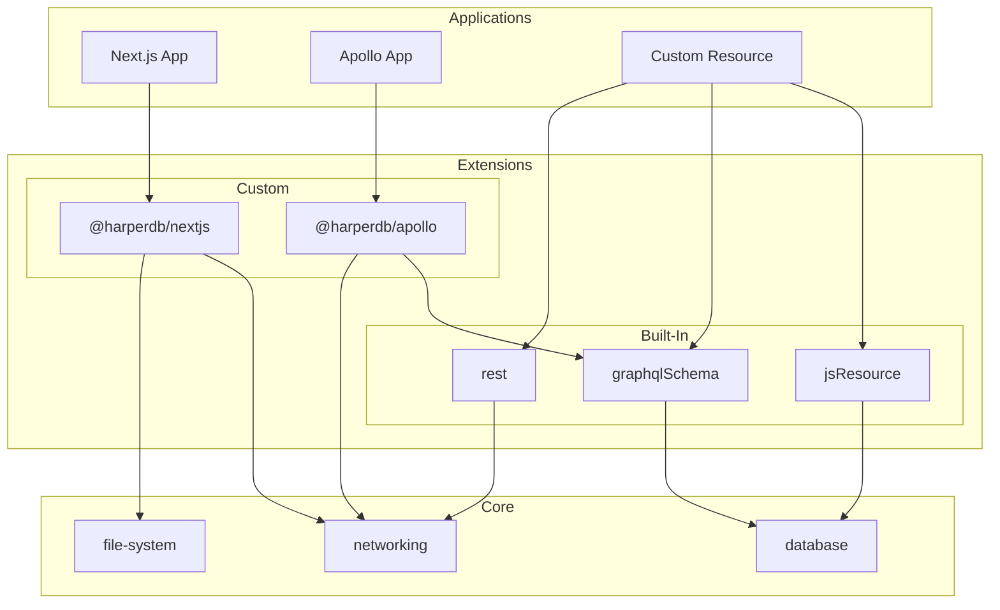

# Components

**Components** are the high-level concept for modules that extend the Harper core platform adding additional functionality. The application you built in the previous section is an example of a component. In addition to applications, components also encompass extensions.

**Applications** are best defined as the implementation of a specific user-facing feature or functionality. Applications are built on top of extensions and can be thought of as the end product that users interact with. For example, a Next.js application that serves a web interface or an Apollo GraphQL server that provides a GraphQL API are both applications.

**Extensions** are the building blocks of the Harper component system. Applications depend on extensions to provide the functionality the application is implementing. For example, the built-in `graphqlSchema` extension enables applications to define their databases and tables using GraphQL schemas. Furthermore, the `@harperdb/nextjs` and `@harperdb/apollo` extensions are the building blocks that provide support for building Next.js and Apollo applications.

All together, the support for implementing a feature is the extension, and the actual implementation of the feature is the application.

Extensions can also depend on other extensions. For example, the [`@harperdb/apollo`](https://github.com/HarperDB/apollo) extension depends on the built-in `graphqlSchema` extension to create a cache table for Apollo queries. Applications can then use the `@harperdb/apollo` extension to implement an Apollo GraphQL backend server.

> As of Harper v4.6, a new, **experimental** component system has been introduced called **plugins**. Plugins are a **new iteration of the existing extension system**. They are simultaneously a simplification and an extensibility upgrade. Instead of defining multiple methods (`start` vs `startOnMainThread`, `handleFile` vs `setupFile`, `handleDirectory` vs `setupDirectory`), plugins only have to define a single `handleComponent` method. Plugins are **experimental**, and complete documentation is available on the [Plugin API](./plugins.md) page. In time we plan to deprecate the concept of extensions in favor of plugins, but for now, both are supported.

Beyond applications and extensions, components are further classified as built-in or custom. **Built-in** components are included with Harper by default and can be directly referenced by their name. The `graphqlSchema`, `rest`, and `jsResource` extensions used in the previous application example are all examples of built-in extensions. **Custom** components must use external references, generally npm or GitHub packages, and are often included as dependencies within the `package.json` of the component.

> Harper maintains a number of custom components that are available on `npm` and `GitHub`, such as the [`@harperdb/nextjs`](https://github.com/HarperDB/nextjs) extension or the [`@harperdb/status-check`](https://github.com/HarperDB/status-check) application.

Harper does not currently include any built-in applications, making "custom applications" a bit redundant. Generally, we just say "application". However, there is a multitude of both built-in and custom extensions, and so the documentation refers to them as such. A complete list of built-in extensions is available in the [Built-In Extensions](./built-in.md) documentation page, and the list of custom extensions and applications is available below.

Complete reference documentation for all built-ins, extensions, and plugins is available in the Technical Details section of the documentation.
- [Built-In Extensions](./built-in.md)
- [Extension API Reference](./extensions.md)
- [Plugin API Reference](./plugins.md)

## Custom Applications

- [`@harperdb/status-check`](https://github.com/HarperDB/status-check)
- [`@harperdb/prometheus-exporter`](https://github.com/HarperDB/prometheus-exporter)
- [`@harperdb/acl-connect`](https://github.com/HarperDB/acl-connect)

## Custom Extensions

- [`@harperdb/nextjs`](https://github.com/HarperDB/nextjs)
- [`@harperdb/apollo`](https://github.com/HarperDB/apollo)
- [`@harperdb/astro`](https://github.com/HarperDB/astro)