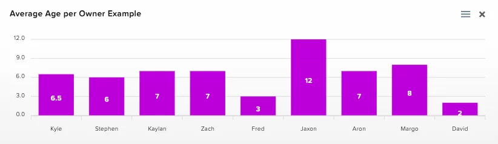

# Charts

The HarperDB Studio includes a charting feature within an instance. They are generated in real time based on your existing data and automatically refreshed every 15 seconds. Instance charts can be accessed with the following instructions:

1) Navigate to the [HarperDB Studio Organizations](https://studio.harperdb.io/organizations) page. 
2) Click the appropriate organization that the instance belongs to. 
3) Select your desired instance. 
4) Click **charts** in the instance control bar.

## Creating a New Chart

Charts are generated based on SQL queries, therefore to build a new chart you first need to build a query. Instructions as follows (starting on the charts page described above):

1) Click **query** in the instance control bar. 
2) Enter the SQL query you would like to generate a chart from.

    *For example, using the dog demo data from the API Docs, we can get get the average dog age per owner with the following query: `SELECT AVG(age) as avg_age, owner_name FROM dev.dog GROUP BY owner_name`.*

3) Click **Execute**.

4) Click **create chart** at the top right of the results table.

5) Configure your chart.

   1) Choose chart type.
   
      *HarperDB Studio offers many standard charting options like line, bar, etc.*
   
   2) Choose a data column.
   
      *This column will be used to plot the data point. Typically, this is the values being calculated in the `SELECT` statement. Depending on the chart type, you can select multiple data columns to display on a single chart.*
   3) Depending on the chart type, you will need to select a grouping.
   
      *This could be labeled as x-axis, label, etc. This will be used to group the data, typically this is what you used in your **GROUP BY** clause.*
   
   4) Enter a chart name.
   
      *Used for identification purposes and will be displayed at the top of the chart.*
   
   5) Choose visible to all org users toggle.
   
      *Leaving this option off will limit chart visibility to just your HarperDB Studio user. Toggling it on will enable all users with this Organization to view this chart.*
   
   6) Click **Add Chart**.
   
   7) The chart will now be visible on the **charts** page.
   
The example query above, configured as a bar chart, results in the following chart:

## Downloading Charts
HarperDB Studio charts can be downloaded in SVG, PNG, and CSV format. Instructions as follows (starting on the charts page described above):

1) Identify the chart you would like to export. 
2) Click the three bars icon ().

3) Select the appropriate download option.

4) The Studio will generate the export and begin downloading immediately.

## Delete a Chart

Delete a chart as follows (starting on the charts page described above):

1) Identify the chart you would like to delete.

2) Click the X icon (Charts X Icon).

3) Click the **confirm delete chart** button.

4) The chart will be deleted.

Deleting a chart that is visible to all Organization users will delete it for all users.