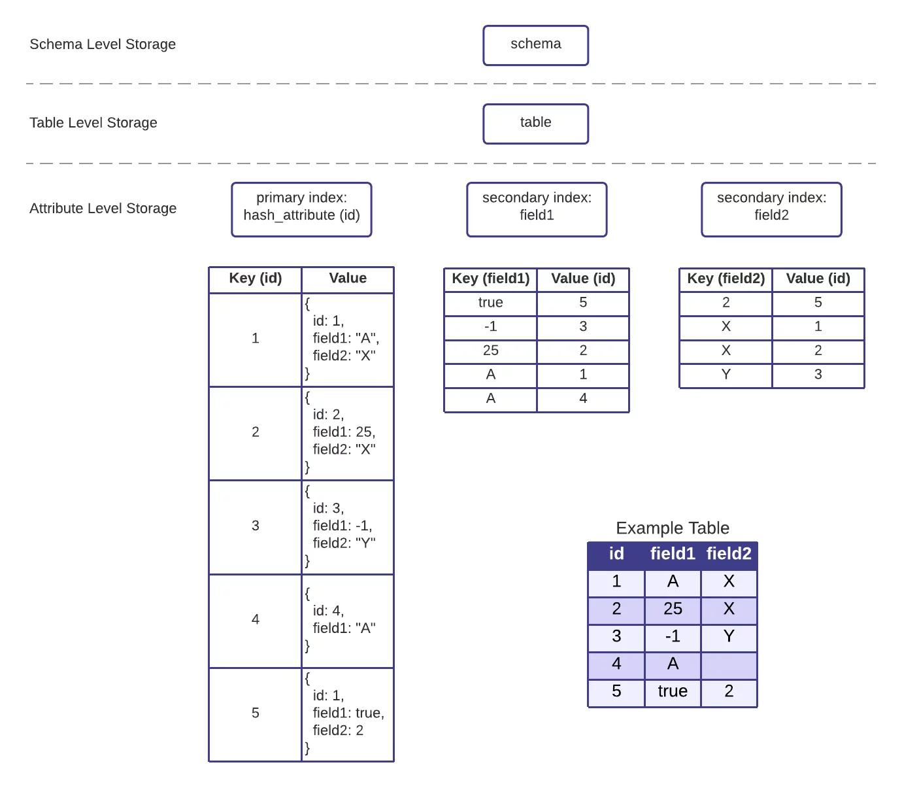

# Storage Algorithm

The HarperDB storage algorithm is fundamental to the HarperDB core functionality, enabling the [Dynamic Schema](dynamic-schema.md) and all other user-facing functionality. HarperDB is built on top of Lightning Memory-Mapped Database (LMDB), a key-value store offering industry leading performance and functionality, which allows for our storage algorithm to store data in tables as rows/objects. This document will provide additional details on how data is stored within HarperDB.

## Query Language Agnostic

The HarperDB storage algorithm was designed to abstract the data storage from any individual query language. HarperDB currently supports both SQL and NoSQL on top of this storage algorithm, with the ability to add additional query languages in the future. This means data can be inserted via NoSQL and read via SQL while hitting the same underlying data storage.

## ACID Compliant

Utilizing Multi-Version Concurrency Control (MVCC) through LMDB, HarperDB offers ACID compliance independently on each node. Readers and writers operate independently of each other, meaning readers don’t block writers and writers don’t block readers. Each HarperDB table has a single writer process, avoiding deadlocks and assuring that writes are executed in the order in which they were received. HarperDB tables can have multiple reader processes operating at the same time for consistent, high scale reads.

## Universally Indexed

All top level attributes are automatically indexed immediately upon ingestion. The [HarperDB Dynamic Schema](dynamic-schema.md) reflexively creates both the attribute and index reflexively as new schema metadata comes in. Indexes are agnostic of datatype, honoring the following order: booleans, numbers ordered naturally, strings ordered lexically. Within the LMDB implementation, table records are grouped together into a single LMDB environment file, where each attribute index is a sub-database (dbi) inside said environment file. An example of the indexing scheme can be seen below.

## Additional LMDB Benefits

HarperDB inherits both functional and performance benefits by implementing LMDB as the underlying key-value store. Data is memory-mapped, which enables quick data access without data duplication. All writers are fully serialized, making writes deadlock-free. LMDB is built to maximize operating system features and functionality, fully exploiting buffer cache and built to run in CPU cache. To learn more about LMDB, visit their documentation.

## HarperDB Indexing Example (Single Table)

