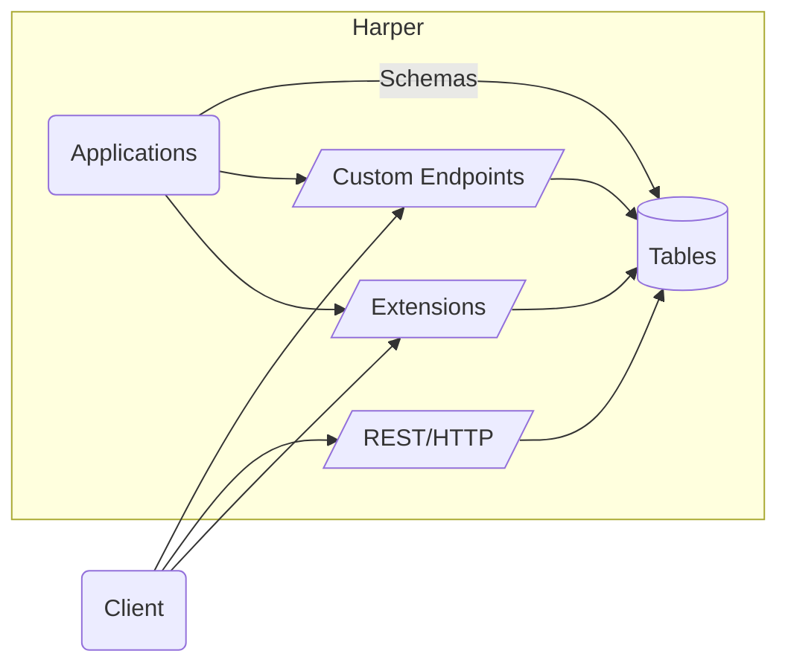

# Applications

## Overview of Harper Applications

Harper is more than a database, it's a distributed clustering platform allowing you to package your schema, endpoints and application logic and deploy them to an entire fleet of Harper instances optimized for on-the-edge scalable data delivery.

In this guide, we are going to explore the evermore extensible architecture that Harper provides by building a Harper component, a fundamental building-block of the Harper ecosystem.

When working through this guide, we recommend you use the [Harper Application Template](https://github.com/HarperDB/application-template) repo as a reference.

## Understanding the Component Application Architecture

Harper provides several types of components. Any package that is added to Harper is called a "component", and components are generally categorized as either "applications", which deliver a set of endpoints for users, or "extensions", which are building blocks for features like authentication, additional protocols, and connectors that can be used by other components. Components can be added to the `hdb/components` directory and will be loaded by Harper when it starts. Components that are remotely deployed to Harper (through the studio or the operation API) are installed into the `hdb/node_modules` directory. Using `harperdb run .` or `harperdb dev .` allows us to specifically load a certain application in addition to any that have been manually added to `hdb/components` or installed (in `hdb/node_modules`).



## Custom Functionality with JavaScript

[The getting started guide](../../getting-started/first-harper-app) covers how to build an application entirely through schema configuration. However, if your application requires more custom functionality, you will probably want to employ your own JavaScript modules to implement more specific features and interactions. This gives you tremendous flexibility and control over how data is accessed and modified in Harper. Let's take a look at how we can use JavaScript to extend and define "resources" for custom functionality. Let's add a property to the dog records when they are returned, that includes their age in human years. In Harper, data is accessed through our [Resource API](../../technical-details/reference/resource), a standard interface to access data sources, tables, and make them available to endpoints. Database tables are `Resource` classes, and so extending the function of a table is as simple as extending their class.

To define custom (JavaScript) resources as endpoints, we need to create a `resources.js` module (this goes in the root of your application folder). And then endpoints can be defined with Resource classes that `export`ed. This can be done in addition to, or in lieu of the `@export`ed types in the schema.graphql. If you are exporting and extending a table you defined in the schema make sure you remove the `@export` from the schema so that don't export the original table or resource to the same endpoint/path you are exporting with a class. Resource classes have methods that correspond to standard HTTP/REST methods, like `get`, `post`, `patch`, and `put` to implement specific handling for any of these methods (for tables they all have default implementations). To do this, we get the `Dog` class from the defined tables, extend it, and export it:

```javascript
// resources.js:
const { Dog } = tables; // get the Dog table from the Harper provided set of tables (in the default database)

export class DogWithHumanAge extends Dog {
	get(query) {
		this.humanAge = 15 + this.age * 5; // silly calculation of human age equivalent
		return super.get(query);
	}
}
```

Here we exported the `DogWithHumanAge` class (exported with the same name), which directly maps to the endpoint path. Therefore, now we have a `/DogWithHumanAge/<dog-id>` endpoint based on this class, just like the direct table interface that was exported as `/Dog/<dog-id>`, but the new endpoint will return objects with the computed `humanAge` property. Resource classes provide getters/setters for every defined attribute so that accessing instance properties like `age`, will get the value from the underlying record. The instance holds information about the primary key of the record so updates and actions can be applied to the correct record. And changing or assigning new properties can be saved or included in the resource as it returned and serialized. The `return super.get(query)` call at the end allows for any query parameters to be applied to the resource, such as selecting individual properties (with a [`select` query parameter](../rest#select-properties)).

Often we may want to incorporate data from other tables or data sources in your data models. Next, let's say that we want a `Breed` table that holds detailed information about each breed, and we want to add that information to the returned dog object. We might define the Breed table as (back in schema.graphql):

```graphql
type Breed @table {
	name: String @primaryKey
	description: String @indexed
	lifespan: Int
	averageWeight: Float
}
```

And next we will use this table in our `get()` method. We will call the new table's (static) `get()` method to retrieve a breed by id. To do this correctly, we access the table using our current context by passing in `this` as the second argument. This is important because it ensures that we are accessing the data atomically, in a consistent snapshot across tables. This provides automatically tracking of most recently updated timestamps across resources for caching purposes. This allows for sharing of contextual metadata (like user who requested the data), and ensure transactional atomicity for any writes (not needed in this get operation, but important for other operations). The resource methods are automatically wrapped with a transaction (will commit/finish when the method completes), and this allows us to fully utilize multiple resources in our current transaction. With our own snapshot of the database for the Dog and Breed table we can then access data like this:

```javascript
//resource.js:
const { Dog, Breed } = tables; // get the Breed table too
export class DogWithBreed extends Dog {
	async get(query) {
		let breedDescription = await Breed.get(this.breed, this);
		this.breedDescription = breedDescription;
		return super.get(query);
	}
}
```

The call to `Breed.get` will return an instance of the `Breed` resource class, which holds the record specified the provided id/primary key. Like the `Dog` instance, we can access or change properties on the Breed instance.

Here we have focused on customizing how we retrieve data, but we may also want to define custom actions for writing data. While HTTP PUT method has a specific semantic definition (replace current record), a common method for custom actions is through the HTTP POST method. the POST method has much more open-ended semantics and is a good choice for custom actions. POST requests are handled by our Resource's post() method. Let's say that we want to define a POST handler that adds a new trick to the `tricks` array to a specific instance. We might do it like this, and specify an action to be able to differentiate actions:

```javascript
export class CustomDog extends Dog {
	async post(data) {
		if (data.action === 'add-trick')
			this.tricks.push(data.trick);
	}
}
```

And a POST request to /CustomDog/ would call this `post` method. The Resource class then automatically tracks changes you make to your resource instances and saves those changes when this transaction is committed (again these methods are automatically wrapped in a transaction and committed once the request handler is finished). So when you push data on to the `tricks` array, this will be recorded and persisted when this method finishes and before sending a response to the client.

The `post` method automatically marks the current instance as being update. However, you can also explicitly specify that you are changing a resource by calling the `update()` method. If you want to modify a resource instance that you retrieved through a `get()` call (like `Breed.get()` call above), you can call its `update()` method to ensure changes are saved (and will be committed in the current transaction).

We can also define custom authorization capabilities. For example, we might want to specify that only the owner of a dog can make updates to a dog. We could add logic to our `post` method or `put` method to do this, but we may want to separate the logic so these methods can be called separately without authorization checks. The [Resource API](../../technical-details/reference/resource) defines `allowRead`, `allowUpdate`, `allowCreate`, and `allowDelete`, or to easily configure individual capabilities. For example, we might do this:

```javascript
export class CustomDog extends Dog {
	allowUpdate(user) {
		return this.owner === user.username;
	}
}
```

Any methods that are not defined will fall back to Harper's default authorization procedure based on users' roles. If you are using/extending a table, this is based on Harper's [role based access](../security/users-and-roles). If you are extending the base `Resource` class, the default access requires super user permission.

You can also use the `default` export to define the root path resource handler. For example:

```javascript
// resources.json
export default class CustomDog extends Dog {
	...
```

This will allow requests to url like // to be directly resolved to this resource.

## Define Custom Data Sources

We can also directly implement the Resource class and use it to create new data sources from scratch that can be used as endpoints. Custom resources can also be used as caching sources. Let's say that we defined a `Breed` table that was a cache of information about breeds from another source. We could implement a caching table like:

```javascript
const { Breed } = tables; // our Breed table
class BreedSource extends Resource { // define a data source
	async get() {
  return (await fetch(`https://best-dog-site.com/${this.getId()}`)).json();
	}
}
// define that our breed table is a cache of data from the data source above, with a specified expiration
Breed.sourcedFrom(BreedSource, { expiration: 3600 });
```

The [caching documentation](./caching) provides much more information on how to use Harper's powerful caching capabilities and set up data sources.

Harper provides a powerful JavaScript API with significant capabilities that go well beyond a "getting started" guide. See our documentation for more information on using the [`globals`](../../technical-details/reference/globals) and the [Resource interface](../../technical-details/reference/resource).

## Configuring Applications/Components

Every application or component can define their own configuration in a `config.yaml`. If you are using the application template, you will have a [default configuration in this config file](https://github.com/HarperDB/application-template/blob/main/config.yaml) (which is default configuration if no config file is provided). Within the config file, you can configure how different files and resources are loaded and handled. The default configuration file itself is documented with directions. Each entry can specify any `files` that the loader will handle, and can also optionally specify what, if any, URL `path`s it will handle. A path of `/` means that the root URLs are handled by the loader, and a path of `.` indicates that the URLs that start with this application's name are handled.

This config file allows you define a location for static files, as well (that are directly delivered as-is for incoming HTTP requests).

Each configuration entry can have the following properties, in addition to properties that may be specific to the individual component:

* `files`: This specifies the set of files that should be handled the component. This is a glob pattern, so a set of files can be specified like "directory/**".
* `path`: This is the URL path that is handled by this component.
* `root`: This specifies the root directory for mapping file paths to the URLs. For example, if you want all the files in `web/**` to be available in the root URL path via the static handler, you could specify a root of `web`, to indicate that the web directory maps to the root URL path.
* `package`: This is used to specify that this component is a third party package, and can be loaded from the specified package reference (which can be an NPM package, Github reference, URL, etc.).

## Define Fastify Routes

Exporting resource will generate full RESTful endpoints. But, you may prefer to define endpoints through a framework. Harper includes a resource plugin for defining routes with the Fastify web framework. Fastify is a full-featured framework with many plugins, that provides sophisticated route definition capabilities.

By default, applications are configured to load any modules in the `routes` directory (matching `routes/*.js`) with Fastify's autoloader, which will allow these modules to export a function to define fastify routes. See the [defining routes documentation](./define-routes) for more information on how to create Fastify routes.

However, Fastify is not as fast as Harper's RESTful endpoints (about 10%-20% slower/more-overhead), nor does it automate the generation of a full uniform interface with correct RESTful header interactions (for caching control), so generally the Harper's REST interface is recommended for optimum performance and ease of use.

## Restarting Your Instance

Generally, Harper will auto-detect when files change and auto-restart the appropriate threads. However, if there are changes that aren't detected, you may manually restart, with the `restart_service` operation:

```json
{
	"operation": "restart_service",
	"service": "http_workers"
}
```
