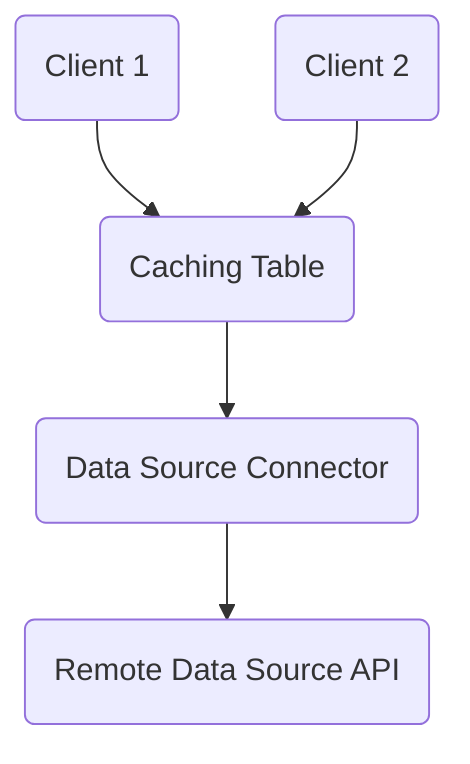

# Caching

Harper has integrated support for caching data from external sources. With built-in caching capabilities and distributed high-performance low-latency responsiveness, Harper makes an ideal data caching server. Harper can store cached data in standard tables, as queryable structured data, so data can easily be consumed in one format (for example JSON or CSV) and provided to end users in different formats with different selected properties (for example MessagePack, with a subset of selected properties), or even with customized querying capabilities. Harper also manages and provides timestamps/tags for proper caching control, facilitating further downstreaming caching. With these combined capabilities, Harper is an extremely fast, interoperable, flexible, and customizable caching server.

## Configuring Caching

To set up caching, first you will need to define a table that you will use as your cache (to store the cached data). You can review the [introduction to building applications](./) for more information on setting up the application (and the [defining schemas documentation](./defining-schemas)), but once you have defined an application folder with a schema, you can add a table for caching to your `schema.graphql`:

```graphql
type MyCache @table(expiration: 3600) @export {
	id: ID @primaryKey
}
```

You may also note that we can define a time-to-live (TTL) expiration on the table, indicating when table records/entries should expire and be evicted from this table. This is generally necessary for "passive" caches where there is no active notification of when entries expire. However, this is not needed if you provide a means of notifying when data is invalidated and changed. The units for expiration, and other duration-based properties, are in seconds.

While you can provide a single expiration time, there are actually several expiration timings that are potentially relevant, and can be independently configured. These settings are available as directive properties on the table configuration (like `expiration` above): stale expiration: The point when a request for a record should trigger a request to origin (but might possibly return the current stale record depending on policy) must-revalidate expiration: The point when a request for a record must make a request to origin first and return the latest value from origin. eviction expiration: The point when a record is actually removed from the caching table.

You can provide a single expiration and it defines the behavior for all three. You can also provide three settings for expiration, through table directives:

- `expiration` - The amount of time until a record goes stale.
- `eviction` - The amount of time after expiration before a record can be evicted (defaults to zero).
- `scanInterval` - The interval for scanning for expired records (defaults to one quarter of the total of expiration and eviction).

#### How `scanInterval` Determines the Eviction Cycle

`scanInterval` determines fixed clock-aligned times when eviction runs, and these times are the same regardless of when the server started. Harper takes the `scanInterval` and divides the TTL (`expiration` + `eviction`) into evenly spaced “anchor times.” These anchors are calculated in the local timezone of the server. This allows Harper to “snap” the eviction schedule to predictable points on the clock, such as every 15 minutes or every 6 hours, based on the interval length. As a result:

- The server’s startup time does not affect when eviction runs.
- Eviction timings are deterministic and timezone-aware.
- For any given configuration, the eviction schedule is the same across restarts and across servers in the same local timezone.

#### Example: 1-Hour Expiration

`expiration` = 1 hour with default `scanInterval` (15 minutes, one quarter of `expiration`). This creates the following fixed eviction schedule:

```
00:00  
00:15  
00:30  
00:45  
01:00  
... continuing every 15 minutes ...
```

If the server starts at 12:05 it does not run eviction at 12:20 or “15 minutes after startup.” Instead, the next scheduled anchor is 12:15, then 12:30, 12:45, 13:00, etc. The schedule is clock-aligned, not startup-aligned.

#### Example: 1-Day Expiration

`expiration` = 1 day with default `scanInterval` (6 hours, one quarter of `expiration`). This creates the following fixed eviction schedule:

```
00:00  
06:00  
12:00  
18:00
... continuing every 6 hours ...
```

If the server starts at 12:05 the next matching eviction time is 18:00 the same day, then 00:00, 06:00, 12:00, 18:00, etc. If the server starts at 19:30 the schedule does not shift. Instead, the next anchor time is 00:00, and the regular 6-hour cycle continues.

## Define External Data Source

Next, you need to define the source for your cache. External data sources could be HTTP APIs, other databases, microservices, or any other source of data. This can be defined as a resource class in your application's `resources.js` module. You can extend the `Resource` class (which is available as a global variable in the Harper environment) as your base class. The first method to implement is a `get()` method to define how to retrieve the source data. For example, if we were caching an external HTTP API, we might define it as such:

```javascript
class ThirdPartyAPI extends Resource {
	async get() {
		return (await fetch(`https://some-api.com/${this.getId()}`)).json();
	}
}
```

Next, we define this external data resource as the "source" for the caching table we defined above:

```javascript
const { MyCache } = tables;
MyCache.sourcedFrom(ThirdPartyAPI);
```

Now we have a fully configured and connected caching table. If you access data from `MyCache` (for example, through the REST API, like `/MyCache/some-id`), Harper will check to see if the requested entry is in the table and return it if it is available (and hasn't expired). If there is no entry, or it has expired (it is older than one hour in this case), it will go to the source, calling the `get()` method, which will then retrieve the requested entry. Once the entry is retrieved, it will be saved/cached in the caching table (for one hour based on our expiration time).



Harper handles waiting for an existing cache resolution to finish and uses its result. This prevents a "cache stampede" when entries expire, ensuring that multiple requests to a cache entry will all wait on a single request to the data source.

Cache tables with an expiration are periodically pruned for expired entries. Because this is done periodically, there is usually some amount of time between when a record has expired and when the record is actually evicted (the cached data is removed). But when a record is checked for availability, the expiration time is used to determine if the record is fresh (and the cache entry can be used).

### Eviction with Indexing

Eviction is the removal of a locally cached copy of data, but it does not imply the deletion of the actual data from the canonical or origin data source. Because evicted records still exist (just not in the local cache), if a caching table uses expiration (and eviction), and has indexing on certain attributes, the data is not removed from the indexes. The indexes that reference the evicted record are preserved, along with the attribute data necessary to maintain these indexes. Therefore eviction means the removal of non-indexed data (in this case evictions are stored as "partial" records). Eviction only removes the data that can be safely removed from a cache without affecting the integrity or behavior of the indexes. If a search query is performed that matches this evicted record, the record will be requested on-demand to fulfill the search query.

### Specifying a Timestamp

In the example above, we simply retrieved data to fulfill a cache request. We may want to supply the timestamp of the record we are fulfilling as well. This can be set on the context for the request:

```javascript
class ThirdPartyAPI extends Resource {
	async get() {
		let response = await fetch(`https://some-api.com/${this.getId()}`);
		this.getContext().lastModified = response.headers.get('Last-Modified');
		return response.json();
	}
}
```

#### Specifying an Expiration

In addition, we can also specify when a cached record "expires". When a cached record expires, this means that a request for that record will trigger a request to the data source again. This does not necessarily mean that the cached record has been evicted (removed), although expired records will be periodically evicted. If the cached record still exists, the data source can revalidate it and return it. For example:

```javascript
class ThirdPartyAPI extends Resource {
 async get() {
  const context = this.getContext();
  let headers = new Headers();
  if (context.replacingVersion) // this is the existing cached record
   headers.set('If-Modified-Since', new Date(context.replacingVersion).toUTCString());
  let response = await fetch(`https://some-api.com/${this.getId()}`, { headers });
  let cacheInfo = response.headers.get('Cache-Control');
  let maxAge = cacheInfo?.match(/max-age=(\d)/)?.[1];
  if (maxAge) // we can set a specific expiration time by setting context.expiresAt
   context.expiresAt = Date.now() + maxAge * 1000; // convert from seconds to milliseconds and add to current time
  // we can just revalidate and return the record if the origin has confirmed that it has the same version:
  if (response.status === 304) return context.replacingRecord;
  ...
```

## Active Caching and Invalidation

The cache we have created above is a "passive" cache; it only pulls data from the data source as needed, and has no knowledge of if and when data from the data source has actually changed, so it must rely on timer-based expiration to periodically retrieve possibly updated data. This means that it is possible that the cache may have stale data for a while (if the underlying data has changed, but the cached data hasn't expired), and the cache may have to refresh more than necessary if the data source data hasn't changed. Consequently it can be significantly more effective to implement an "active" cache, in which the data source is monitored and notifies the cache when any data changes. This ensures that when data changes, the cache can immediately load the updated data, and unchanged data can remain cached much longer (or indefinitely).

### Invalidate

One way to provide more active caching is to specifically invalidate individual records. Invalidation is useful when you know the source data has changed, and the cache needs to re-retrieve data from the source the next time that record is accessed. This can be done by executing the `invalidate()` method on a resource. For example, you could extend a table (in your resources.js) and provide a custom POST handler that does invalidation:

```javascript
const { MyTable } = tables;
export class MyTableEndpoint extends MyTable {
	async post(data) {
		if (data.invalidate)
			// use this flag as a marker
			this.invalidate();
	}
}
```

(Note that if you are now exporting this endpoint through resources.js, you don't necessarily need to directly export the table separately in your schema.graphql).

### Subscriptions

We can provide more control of an active cache with subscriptions. If there is a way to receive notifications from the external data source of data changes, we can implement this data source as an "active" data source for our cache by implementing a `subscribe` method. A `subscribe` method should return an asynchronous iterable that iterates and returns events indicating the updates. One straightforward way of creating an asynchronous iterable is by defining the `subscribe` method as an asynchronous generator. If we had an endpoint that we could poll for changes every second, we could implement this like:

```javascript
class ThirdPartyAPI extends Resource {
 async *subscribe() {
      setInterval(() => { // every second retrieve more data
   // get the next data change event from the source
   let update = (await fetch(`https://some-api.com/latest-update`)).json();
   const event = { // define the change event (which will update the cache)
    type: 'put', // this would indicate that the event includes the new data value
    id: // the primary key of the record that updated
    value: // the new value of the record that updated
    timestamp: // the timestamp of when the data change occurred
   };
   yield event; // this returns this event, notifying the cache of the change
      }, 1000);
 }
 async get() {
...
```

Notification events should always include an `id` property to indicate the primary key of the updated record. The event should have a `value` property for `put` and `message` event types. The `timestamp` is optional and can be used to indicate the exact timestamp of the change. The following event `type`s are supported:

- `put` - This indicates that the record has been updated and provides the new value of the record.
- `invalidate` - Alternately, you can notify with an event type of `invalidate` to indicate that the data has changed, but without the overhead of actually sending the data (the `value` property is not needed), so the data only needs to be sent if and when the data is requested through the cache. An `invalidate` will evict the entry and update the timestamp to indicate that there is new data that should be requested (if needed).
- `delete` - This indicates that the record has been deleted.
- `message` - This indicates a message is being passed through the record. The record value has not changed, but this is used for [publish/subscribe messaging](../real-time).
- `transaction` - This indicates that there are multiple writes that should be treated as a single atomic transaction. These writes should be included as an array of data notification events in the `writes` property.

And the following properties can be defined on event objects:

- `type`: The event type as described above.
- `id`: The primary key of the record that updated
- `value`: The new value of the record that updated (for put and message)
- `writes`: An array of event properties that are part of a transaction (used in conjunction with the transaction event type).
- `table`: The name of the table with the record that was updated. This can be used with events within a transaction to specify events across multiple tables.
- `timestamp`: The timestamp of when the data change occurred

With an active external data source with a `subscribe` method, the data source will proactively notify the cache, ensuring a fresh and efficient active cache. Note that with an active data source, we still use the `sourcedFrom` method to register the source for a caching table, and the table will automatically detect and call the subscribe method on the data source.

By default, Harper will only run the subscribe method on one thread. Harper is multi-threaded and normally runs many concurrent worker threads, but typically running a subscription on multiple threads can introduce overlap in notifications and race conditions and running on a subscription on a single thread is preferable. However, if you want to enable subscribe on multiple threads, you can define a `static subscribeOnThisThread` method to specify if the subscription should run on the current thread:

```javascript
class ThirdPartyAPI extends Resource {
 static subscribeOnThisThread(threadIndex) {
  return threadIndex < 2; // run on two threads (the first two threads)
 }
 async *subscribe() {
  ....
```

An alternative to using asynchronous generators is to use a subscription stream and send events to it. A default subscription stream (that doesn't generate its own events) is available from the Resource's default subscribe method:

```javascript
class ThirdPartyAPI extends Resource {
	subscribe() {
		const subscription = super.subscribe();
		setupListeningToRemoteService().on('update', (event) => {
			subscription.send(event);
		});
		return subscription;
	}
}
```

## Downstream Caching

It is highly recommended that you utilize the [REST interface](../rest) for accessing caching tables, as it facilitates downstreaming caching for clients. Timestamps are recorded with all cached entries. Timestamps are then used for incoming [REST requests to specify the `ETag` in the response](../rest#cachingconditional-requests). Clients can cache data themselves and send requests using the `If-None-Match` header to conditionally get a 304 and preserve their cached data based on the timestamp/`ETag` of the entries that are cached in Harper. Caching tables also have [subscription capabilities](./caching#subscribing-to-caching-tables), which means that downstream caches can be fully "layered" on top of Harper, both as passive or active caches.

## Write-Through Caching

The cache we have defined so far only has data flowing from the data source to the cache. However, you may wish to support write methods, so that writes to the cache table can flow through to underlying canonical data source, as well as populate the cache. This can be accomplished by implementing the standard write methods, like `put` and `delete`. If you were using an API with standard RESTful methods, you can pass writes through to the data source like this:

```javascript
class ThirdPartyAPI extends Resource {
 async put(data) {
  await fetch(`https://some-api.com/${this.getId()}`, {
   method: 'PUT',
   body: JSON.stringify(data)
  });
 }
 async delete() {
  await fetch(`https://some-api.com/${this.getId()}`, {
   method: 'DELETE',
  });
 }
 ...
```

When doing an insert or update to the MyCache table, the data will be sent to the underlying data source through the `put` method and the new record value will be stored in the cache as well.

### Loading from Source in Methods

When you are using a caching table, it is important to remember that any resource methods besides `get()`, will not automatically load data from the source. If you have defined a `put()`, `post()`, or `delete()` method and you need the source data, you can ensure it is loaded by calling the `ensureLoaded()` method. For example, if you want to modify the existing record from the source, adding a property to it:

```javascript
class MyCache extends tables.MyCache {
	async post(data) {
		// if the data is not cached locally, retrieves from source:
		await this.ensuredLoaded();
		// now we can be sure that the data is loaded, and can access properties
		this.quantity = this.quantity - data.purchases;
	}
}
```

### Subscribing to Caching Tables

You can subscribe to a caching table just like any other table. The one difference is that normal tables do not usually have `invalidate` events, but an active caching table may have `invalidate` events. Again, this event type gives listeners an opportunity to choose whether or not to actually retrieve the value that changed.

### Passive-Active Updates

With our passive update examples, we have provided a data source handler with a `get()` method that returns the specific requested record as the response. However, we can also actively update other records in our response handler (if our data source provides data that should be propagated to other related records). This can be done transactionally, to ensure that all updates occur atomically. The context that is provided to the data source holds the transaction information, so we can simply pass the context to any update/write methods that we call. For example, let's say we are loading a blog post, which also includes comment records:

```javascript
const { Post, Comment } = tables;
class BlogSource extends Resource {
 get() {
  const post = await (await fetch(`https://my-blog-server/${this.getId()}`).json());
		for (let comment of post.comments) {
			await Comment.put(comment, this); // save this comment as part of our current context and transaction
		}
		return post;
	}
}
Post.sourcedFrom(BlogSource);
```

Here both the update to the post and the update to the comments will be atomically/transactionally committed together with the same timestamp.

## Cache-Control header

When interacting with cached data, you can also use the `Cache-Control` request header to specify certain caching behaviors. When performing a PUT (or POST) method, you can use the `max-age` directive to indicate how long the resource should be cached (until stale):

```http
PUT /my-resource/id
Cache-Control: max-age=86400
```

You can use the `only-if-cached` directive on GET requests to only return a resource if it is cached (otherwise will return 504). Note, that if the entry is not cached, this will still trigger a request for the source data from the data source. If you do not want source data retrieved, you can add the `no-store` directive. You can also use the `no-cache` directive if you do not want to use the cached resource. If you wanted to check if there is a cached resource without triggering a request to the data source:

```http
GET /my-resource/id
Cache-Control: only-if-cached, no-store
```

You may also use the `stale-if-error` to indicate if it is acceptable to return a stale cached resource when the data source returns an error (network connection error, 500, 502, 503, or 504). The `must-revalidate` directive can indicate a stale cached resource can not be returned, even when the data source has an error (by default a stale cached resource is returned when there is a network connection error).

## Caching Flow

It may be helpful to understand the flow of a cache request. When a request is made to a caching table:

- Harper will first create a resource instance to handle the process, and ensure that the data is loaded for the resource instance. To do this, it will first check if the record is in the table/cache.
  - If the record is not in the cache, Harper will first check if there is a current request to get the record from the source. If there is, Harper will wait for the request to complete and return the record from the cache.
  - If not, Harper will call the `get()` method on the source to retrieve the record. The record will then be stored in the cache.
  - If the record is in the cache, Harper will check if the record is stale. If the record is not stale, Harper will immediately return the record from the cache. If the record is stale, Harper will call the `get()` method on the source to retrieve the record.
  - The record will then be stored in the cache. This will write the record to the cache in a separate asynchronous/background write-behind transaction, so it does not block the current request, then return the data immediately once it has it.
- The `get()` method will be called on the resource instance to return the record to the client (or perform any querying on the record). If this is overriden, the method will be called at this time.

### Caching Flow with Write-Through

When a writes are performed on a caching table (in `put()` or `post()` method, for example), the flow is slightly different:

- Harper will have first created a resource instance to handle the process, and this resource instance that will be the current `this` for a call to `put()` or `post()`.
- If a `put()` or `update()` is called, for example, this action will be record in the current transaction.
- Once the transaction is committed (which is done automatically as the request handler completes), the transaction write will be sent to the source to update the data.
  - The local writes will wait for the source to confirm the writes have completed (note that this effectively allows you to perform a two-phase transactional write to the source, and the source can confirm the writes have completed before the transaction is committed locally).
  - The transaction writes will then be written the local caching table.
- The transaction handler will wait for the local commit to be written, then the transaction will be resolved and a response will be sent to the client.
