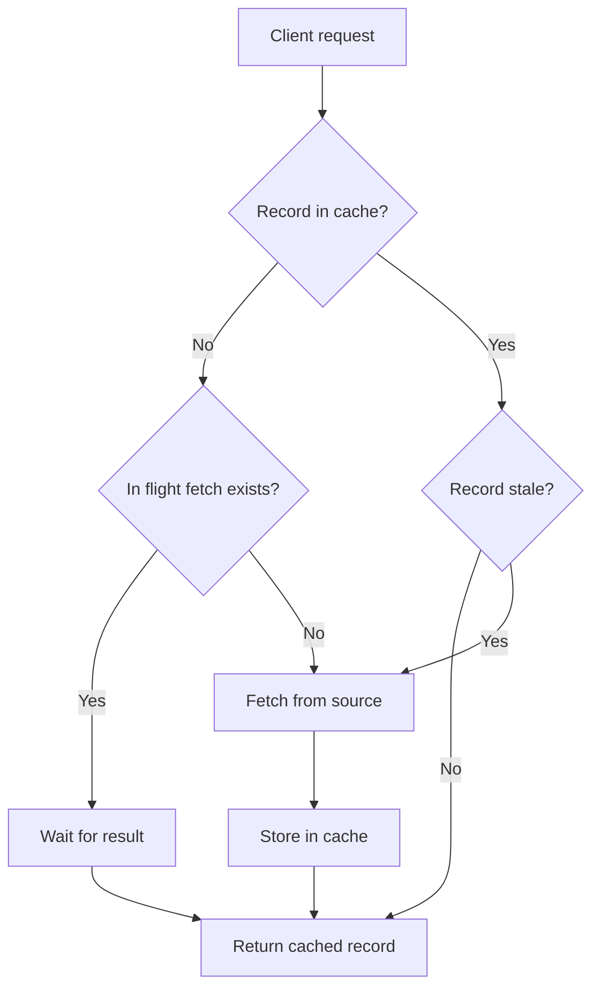
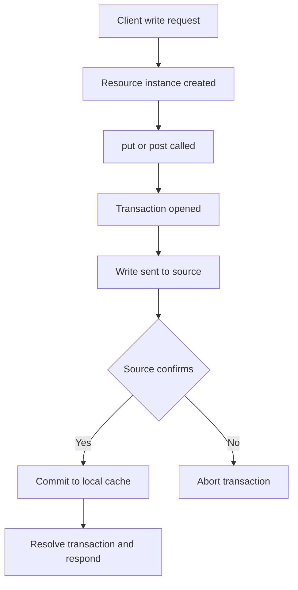

# Caching
Harper provides integrated caching features for external data sources. This page documents all schema directives, configuration options, and resource APIs relevant to caching.

## Schema Directives

### `@table(expiration: <seconds>)`
Defines a table with caching behavior and optional expiration time (TTL).
- expiration: Time in seconds before a record becomes stale.
- Example:
    ```graphql
    type MyCache @table(expiration: 3600) {
        id: ID @primaryKey
    }
    ```
#### Expiration Properties
You can configure multiple timing behaviors:
- **expiration** – Time until record goes stale.
- **eviction** – Time after expiration before the record is removed. Defaults to 0.
- **scanInterval** – Interval for scanning expired records. Defaults to ¼ of (expiration + eviction).

If only `expiration` is provided, it applies to all behaviors.

## Eviction with Indexing
Eviction removes the non-indexed data of a cached record once it expires. However:
- Indexed attributes remain stored so that indexes stay valid.
- Evicted records exist as partial records.
- If a query matches an evicted record, Harper will re-fetch it from the source on demand.

This ensures cache eviction does not break query integrity.


## Resource API
Caching tables must define an external Resource in `resources.js`. Extend the global `Resource` class and implement methods as needed.

### `get()`
Fetches a record from the external data source.
```javascript
class MyAPI extends Resource {
  async get() {
    return (await fetch(`https://api.com/${this.getId()}`)).json();
  }
}
```

### `put(data)`
Write-through update to the source.
```javascript
async put(data) {
  await fetch(`https://api.com/${this.getId()}`, {
    method: 'PUT',
    body: JSON.stringify(data)
  });
}
```

### `delete()`
Removes a record from the source.

### `ensureLoaded()`
Ensures the record is loaded from source when using `put`, `post`, or `delete`.

## Cache Control Context
Each request context supports additional caching metadata:

- `lastModified`: Set timestamp of last modification.
- `expiresAt`: Explicitly set expiration time.
- `replacingRecord`: Existing cached record for revalidation.
- `replacingVersion` – Previous version timestamp for conditional revalidation (`If-Modified-Since`).

Example:
```javascript
this.getContext().lastModified = response.headers.get('Last-Modified');
this.getContext().expiresAt = Date.now() + 60000; // 1 min
```

## Expiration from Source Headers
You can set expirations dynamically based on source responses:
```javascript
let cacheInfo = response.headers.get('Cache-Control');
let maxAge = cacheInfo?.match(/max-age=(\d)/)?.[1];
if (maxAge) context.expiresAt = Date.now() + maxAge * 1000;
```
If the origin responds with `304 Not Modified`, return `context.replacingRecord` instead of re-downloading.

## Invalidation
You can manually invalidate cached records to force re-fetch on next access:
```javascript
const { MyTable } = tables;
export class MyTableEndpoint extends MyTable {
  async post(data) {
    if (data.invalidate) this.invalidate();
  }
}
```
Invalidation removes the cached entry but preserves schema consistency.

## Events and Subscriptions
Caching supports active updates via subscription.

### Supported Event Types
- `put`: Record updated, includes new value.
- `invalidate`: Mark record stale without sending value.
- `delete`: Record removed.
- `message`: Publish/subscribe message.
- `transaction`: Atomic batch of multiple writes.

### Event Properties
- **type**: Event type (above).
- **id**: Primary key of record.
- **value**: Record value (for put or message).
- **writes**: Array of events (for transaction).
- **timestamp**: Optional time of change.
- **table**: Table name (for cross-table transactions).

### subscribe()
Return an async generator or stream to push events.

```javascript
async *subscribe() {
  yield { type: 'put', id: '123', value: { name: 'Harper' } };
}
```

By default, subscriptions run on one worker thread.

You can control this with:

```javascript
static subscribeOnThisThread(threadIndex) {
  return threadIndex < 2; // run on first two threads
}
```

Or use a stream:
```javascript
subscribe() {
  const subscription = super.subscribe();
  remoteService.on('update', (event) => subscription.send(event));
  return subscription;
}
```

## Downstream Caching
Harper includes built-in support for client-side caching:

- All cached entries include ETags.
- Clients can use `If-None-Match` to get a `304 Not Modified` instead of re-downloading.
- Subscription support means clients can layer their own caches (passive or active) on top of Harper.

## Write-Through Caching

If you implement `put()` or `delete()` on a Resource:

- Writes are passed to the canonical source.
- The cache updates locally after source confirms success.
- Harper uses a two-phase transaction:
    - Source confirms the write.
    - Local cache commits the change.

This ensures consistency between the source and the cache.

## Passive–Active Updates
Resources can update related tables during a `get()`.
Use the current context to perform transactional multi-table updates:

```javascript
const { Post, Comment } = tables;
class BlogSource extends Resource {
  async get() {
    const post = await (await fetch(`https://server/${this.getId()}`)).json();
    for (let comment of post.comments) {
      await Comment.put(comment, this); // transactionally linked
    }
    return post;
  }
}
```
Both `Post` and `Comment` are updated atomically with the same timestamp.

## Cache-Control Headers
Caching endpoints respect standard HTTP caching headers:

- `Cache-Control: max-age=<seconds>` – Define TTL.
- `Cache-Control: only-if-cached` – Return 504 if not cached.
- `Cache-Control: no-store` – Do not store result.
- `Cache-Control: no-cache` – Force revalidation.
- `stale-if-error` – Return stale result if source fails.
- `must-revalidate` – Prevent stale return even if source fails.

## Behavior Overview
### Passive Cache Flow


Lookup record in cache.

- If missing/expired → call source `get()`.
- If request in-flight → wait for result.
- On retrieval → save to cache, return to client.
- Expired records may be returned while refresh happens in background.

### Write-Through Flow


- Resource instance created.
- `put()` or `post()` called, transaction opened.
- Write sent to source.
- Source confirms → local cache commits.
- Transaction resolved, response sent to client.

## Example Configurations
### Passive cache with expiration

```javascript
type BreedCache @table(expiration: 3600) @export {
  id: ID @primaryKey
}
```

### Active cache with subscription
```javascript
class BreedAPI extends Resource {
  async *subscribe() {
    yield { type: 'invalidate', id: 'husky' };
  }
}
```